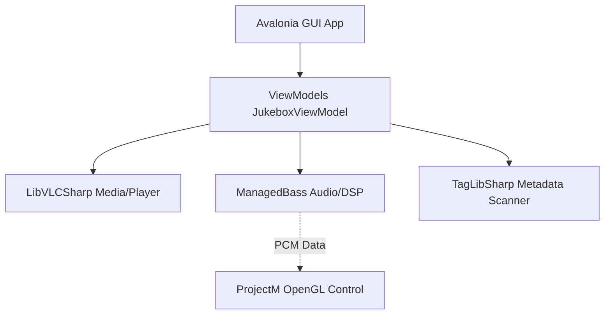

# Jukebox Architecture & Threading Model

This document outlines the architecture, threading constraints, native resource lifecycles, and asynchronous processing models of the Jukebox application. **All AI assistants working on this repository must read this document first** to maintain stability, prevent deadlocks, and avoid native library crashes.

---

## 1. System Architecture

The Jukebox application is a cross-platform desktop media player built with:
*   **Avalonia UI (12.x):** The cross-platform UI framework (using compiled bindings).
*   **LibVLCSharp:** For video playback (wraps native LibVLC).
*   **ManagedBass:** For audio playback and DSP/PCM audio data extraction (wraps native BASS).
*   **JukeboxVisualizations (ProjectM):** A companion library wrapping native OpenGL `libprojectM` to render milkdrop visualizer presets.
*   **TagLibSharp:** For background media metadata extraction.



---

## 2. Native Resource Lifecycles & Disposal Rules

Interfacing with native unmanaged DLLs (`libvlc.dll`, `bass.dll`, `libprojectM.dll`) requires strict sequence enforcement during initialization and shutdown. Failure to adhere to these rules results in instant native **Access Violation** crashes or process deadlocks.

### 2.1. LibVLC (Video Playback)
*   **Blocking Calls:** Commands like `MediaPlayer.Stop()`, `MediaPlayer.Dispose()`, and `Media.Dispose()` invoke native blocking teardown operations. These can block the executing thread for **1–2 seconds**. Therefore, they **must never run on the UI thread**.
*   **Disposal Sequence:** A parent `LibVLC` instance **must not** be disposed of until all child `MediaPlayer` and `Media` objects created from it have completed their stops and disposals.
*   **Task Serialization (`_mediaPlayerDisposalTask`):** To avoid blocking the UI thread during normal track switches (video $\rightarrow$ audio, or next track), disposals are pushed to a sequential background task chain. The VM tracks this chain:
    ```csharp
    var previousTask = _mediaPlayerDisposalTask;
    _mediaPlayerDisposalTask = Task.Run(async () =>
    {
        try { await previousTask; } catch { }
        try { player.Stop(); } catch { }
        try { media?.Dispose(); } catch { }
        try { player.Dispose(); } catch { }
    });
    ```
    During application exit, the async `DisposePlaybackAsync()` chains the parent `LibVLC` disposal and **awaits** the entire chain to complete, ensuring unmanaged memory is safe:
    ```csharp
    await _mediaPlayerDisposalTask; // Block until all media players are dead, then exit/free LibVLC
    ```

### 2.2. ManagedBass (Audio Playback & DSP)
*   **DSP Threading:** BASS processes audio streams and runs DSP procedures (`OnDsp`) on its own **unmanaged internal audio thread**.
*   **Event Dispatch Safety:** When `OnDsp` captures PCM data, it invokes the C# event `PcmDataAvailable`. Since this event executes on BASS's internal thread, all subscribers (such as the UI or rendering controls) must handle thread safety and marshaling carefully.
*   **Equalizer (EQ) Integration:** 
    *   BASS EQ is configured by setting parameters (`DXParamEQParameters`) on unmanaged FX handles (`_eqFxHandles`) attached directly to the active `_bassStream`.
    *   **Track Transitions:** When changing tracks, `StopEngines()` releases the old stream (`Bass.StreamFree`) and clears the active FX handles. During `PlayAudioAsync()`, new FX handles are set up for each of the 10 bands on the newly created stream and populated with the current band gains.
    *   **Binding Lifetime:** The `JukeboxViewModel` remains subscribed to the `EqViewModel.EqBandUpdated` event across all track switches, so changes to EQ sliders instantly update the active stream's parameters. The event is only unsubscribed in `DisposePlaybackAsync()` on application exit.
*   **Teardown Safety:** To prevent the unmanaged BASS thread from raising events while the application is tearing down:
    1.  `PcmDataAvailable = null;` must be called **first** in `DisposePlaybackAsync` to sever all listener bindings.
    2.  `Bass.StreamFree(_bassStream);` is then called to release the stream.
    3.  Finally, `Bass.Free();` is invoked to unload the unmanaged context.

### 2.3. ProjectM (Companion Visualizations)
*   **GL Thread Affinity:** The visualizer control (`ProjectMControl`) inherits from `OpenGlControlBase`. The creation, preset loading (`projectm_load_preset_data`), and rendering (`projectm_opengl_render_frame`) of the ProjectM instance **must only occur on the OpenGL render thread** inside the `OnOpenGlRender` loop.
*   **PCM Queueing:** Since PCM data is fed from BASS's audio thread and rendering occurs on the GL thread, data is passed safely via a `ConcurrentQueue<short[]>` inside `ProjectMControl` to avoid lock contention.

### 2.4. Native Viewport "Airspace" Limitations
*   **No XAML Overlays Over Native Viewports:** Unmanaged hardware-accelerated viewport controls (`LibVLCSharp.Avalonia.VideoView` and OpenGL-based `ProjectMControl`) are rendered via native platform window handles.
*   **Layout Constraint:** These native windows render in a separate layer directly on top of lightweight XAML controls. Overlaying UI panels (like the transport bar or sidebar) on top of them causes the native viewport to obscure/hide the XAML elements.
*   **Design Choice:** To keep controls visible, the application must use side-by-side positioning (`Grid` column/row layout with `SplitView` set to `Inline` mode) rather than overlapping overlays. Resizing viewports is required to prevent clipping.

---

## 3. Asynchronous Threading & Responsiveness

To keep the UI running smoothly at 60 FPS, all CPU-bound or I/O-bound processes are offloaded to background threads.

### 3.1. Virtualized Metadata Tagging
When directories containing thousands of tracks are loaded into the playlist, parsing metadata (`TagLibSharp`) for all files instantly would freeze the application. 
*   **On-Demand Loading:** Tracks are initially loaded with dummy metadata. 
*   **Scroll-Driven Batching:** The `DataGrid` view notifies the view model of the visible index range (`NotifyVisibleRange`).
*   **Background Processing:** The view model triggers `TagVisibleRangeAsync`, which reads tags in small batches (`TagBatchSize = 5`) on background ThreadPool threads (`Task.Run`).
*   **Version Tracking:** To prevent late-completing background reads from writing metadata to the wrong tracks (e.g., if the user clears the playlist and loads a new one while tagging is active), the VM increments `_playlistVersion` and `_scrollVersion`. Completed background tasks reject their results if their captured version doesn't match the current active version.

### 3.2. ProjectM Preset Scan
The visualizations folder contains a massive database of milkdrop presets (9,000+ `.milk` files).
*   **Asynchronous Scan:** `LoadVisualizersAsync` in `JukeboxVisualizerViewModel` processes filesystem scanning recursively inside `Task.Run(...)`.
*   **UI Dispatch:** Once the folders are cataloged, the hierarchical tree node structures are built and dispatched to the UI thread via `Dispatcher.UIThread.Post(...)` to populate the `TreeDataGrid` bindings safely.

---

## 4. Normal Window Closing Lifecycle

When a user closes the player, the exit sequence is orchestrated as follows:
```
[User Clicks Close]
       │
       ▼
[JukeboxView.OnClosing] (Cancel close event temporarily to allow cleanup)
       │
       ▼
[JukeboxViewModel.DisposePlaybackAsync()] 
       ├─► Set PcmDataAvailable = null
       ├─► Stop Eq and Playback Timers
       ├─► Chain Stop/Dispose for active MediaPlayer/LibVLC to _mediaPlayerDisposalTask
       ├─► Await _mediaPlayerDisposalTask
       └─► Free Bass Stream & Bass Context
       │
       ▼
[Task.Delay(100)] (Allow UI bindings to detach and clean up handles)
       │
       ▼
[Window.Close()] (Actually terminate the window)
       │
       ▼
[App.desktop.Exit] -> [JukeboxViewModel.Dispose()] (Triggers quick VM dispose)
```
