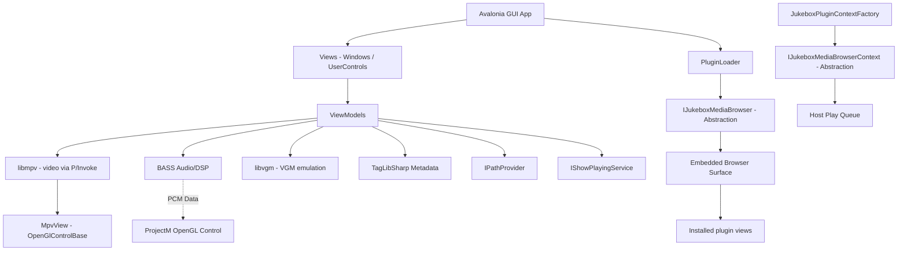

# Jukebox Architecture

This document describes the internal architecture, threading model, native resource lifecycles, and key design decisions. It is intended for contributors maintaining the codebase.

---

## 1. Overview

Jukebox is a cross-platform desktop media player built with:

- **Avalonia UI 12.x** — cross-platform UI framework (compiled bindings)
- **.NET 10.0 / C# 13** — target framework
- **libmpv** — video playback via custom P/Invoke wrapper, rendered into Avalonia's OpenGL context
- **BASS** — audio playback, DSP, and PCM extraction (via `Native/BassNative.cs`)
- **libvgm** — VGM/VGZ/VGX emulation (via `Native/VgmNative.cs` + `Services/Playback/VgmPlaybackEngine.cs`, using the custom fork `RobG66/libvgm`)
- **projectM** — optional visualizations, loaded at runtime via reflection
- **TagLibSharp** — background metadata extraction
- **CommunityToolkit.Mvvm** — source-generator-based MVVM (`[ObservableProperty]`, `[RelayCommand]`)

### Layered Architecture



### Project Layout

The codebase contains the core host application and its shared plugin contract.
Concrete plugins are independently developed and installed as compiled artifacts.

#### 1. Jukebox.Plugin.Abstractions (Shared Contract)
- `IJukeboxMediaBrowser.cs` — Interface implemented by plugins to register an embedded browser view, navigation metadata, URL resolution, and disposal.
- `IJukeboxMediaBrowserContext.cs` — Host services exposed to plugins (`PlayNow`, `ReplaceQueueAndPlay`, `AddToQueue`, `AddRangeToQueue`, stable-URL updates, and `PluginDataDirectory`).
- `PlayRequest.cs` — DTO used to request audio stream playback.

#### 2. Jukebox (Core Application Host)
- `Constants.cs` — Global magic numbers and media type constraints.
- `Program.cs` — Entry point + Avalonia initialization.
- `App.axaml(.cs)` — Application lifecycle and startup dynamic plugin assembly loading.
- `Models/JukeboxTrack.cs` — Universal playback track item.
- `Native/` — Platform P/Invoke bindings (`BassNative.cs`, `VgmNative.cs`).
- `Mpv/` — high-level wrapper and context definitions for `libmpv`.
- `Services/`
  - `Playback/` — Audio, video, and VGM playback engines.
  - `System/`
    - `PluginLoader.cs` — Scans `plugins/` subdirectory, loads DLL assemblies, and instantiates implementations of `IJukeboxMediaBrowser`.
    - `JukeboxPluginContextFactory.cs` — Constructs the `IJukeboxMediaBrowserContext` wrapper per plugin.
- `ViewModels/`
  - `JukeboxViewModel.cs` — Host shell VM orchestrating navigation, EQ, and visualizer.
  - `JukeboxViewModel.Playback.cs` — Master playback coordination.
  - `JukeboxPlaylistViewModel.cs` — Runtime queue and host-owned saved-playlist manager.
- `Views/`
  - `PlaylistView.axaml(.cs)` — Persistent navigation rail, compact host panel, and embedded plugin browser presenter.
  - `ThreeButtonDialogView.axaml(.cs)` — Error/confirm dialog with active-window parenting.
  - `TextInputDialogView.axaml(.cs)` — Text prompt dialog with active-window parenting.

---

## 2. Queue and Saved-Playlist Model

The host owns both playback order and persisted collections:

- **`PlayQueue`** — The only runtime playback collection. Previous, Next, natural advancement, repeat, loop, and shuffle operate exclusively on this collection.
- **`LibraryPlaylist`** — The currently selected saved collection being viewed or edited. It never controls active playback directly.

Playing a saved playlist copies tracks into `PlayQueue`. Editing, clearing, switching, or deleting a saved playlist does not mutate active playback. Saving the queue creates another persisted copy rather than a live link.

Plugin browsers submit normalized `PlayRequest` values through `IJukeboxMediaBrowserContext`. The host maps them to `JukeboxTrack` and performs one of four explicit queue operations: `PlayNow`, `ReplaceQueueAndPlay`, `AddToQueue`, or `AddRangeToQueue`. Plugins never own a runtime playlist or persisted playlist UI.

### Saved Library Playlists

Saved playlists are persisted as JSON files under `<PlaylistsDirectory>/Library/`. The filename (without extension) is the playlist name.

- **Startup behavior:**
  - If `Default.json` exists in the Library folder, it is loaded automatically and "Default" is selected in the combobox.
  - If no `Default.json` exists, the app starts in a transient state.
- **Auto-save:** Changes to the selected library playlist are automatically written to disk.
- **Save As:** The save dialog allows forcing the playlist name to "Default" for subsequent startup loading.

### Plugin Browser Ownership

Each plugin owns its browser view-model, remote-source service, private cache, and optional stable-URL resolver. The Jukebox owns the browser surface, navigation rail, queue, saved playlists, and plugin shutdown lifecycle. `IJukeboxMediaBrowser.Dispose()` is called exactly once during host shutdown.

### Version Tracking

Background tag-reading tasks use `_playlistVersion` and `_scrollVersion` counters to detect stale results. Any structural change (`InvalidatePlaylist()`) or scroll-range change increments the counters. Background tasks capture the version at entry and reject their results if the version has changed by the time they complete.

---

## 3. Native Resource Lifecycles

Interfacing with native unmanaged libraries (`libmpv`, `bass.dll`, optionally `libprojectM`) requires strict sequence enforcement during initialization and shutdown. Failure to follow these rules results in `AccessViolationException` or process deadlocks.

**Native library layout:** Host playback runtimes live under a flat `<appdir>/lib/` folder. The optional ProjectM wrapper, its native libraries, and its assets remain self-contained under `<appdir>/plugins/Avalonia.ProjectM/`. See [DEPENDENCIES.md](DEPENDENCIES.md).

### 3.1. libmpv (Video)

- **Custom wrapper:** `Mpv/MpvNative.cs` declares P/Invoke functions via `DllImport` with a `NativeLibrary.SetDllImportResolver`. The resolver tries `<appdir>/lib/libmpv-2.dll` (Windows), `libmpv.so.2` (Linux), or `libmpv.2.dylib` (macOS), then falls back to the OS default search path.
- **OpenGL render context:** MPV renders into Avalonia's OpenGL context via `mpv_render_context_create` with `MPV_RENDER_API_TYPE_OPENGL`. `MpvView` (an `OpenGlControlBase` subclass) creates the render context in `OnOpenGlRender`, passing `GlInterface.GetProcAddress` as the GL function resolver. No native HWND — no airspace issue.
- **Render update callback:** MPV calls `mpv_render_context_set_update_callback` when a new frame is ready. The callback must not call any mpv API — it schedules a render on the UI thread via `RequestNextFrameRendering()`. The callback delegate is stored in a field to prevent GC collection (libmpv holds a raw function pointer).
- **First-frame race:** `PlayVideoAsync` calls `WaitForRenderContextReadyAsync()` before `LoadFile` — this blocks until `MpvView` has created the render context. Without this, MPV starts decoding before the render surface exists, producing a black first frame.
- **Event thread:** A background `Thread` calls `mpv_wait_event` in a loop to receive property-change notifications (`time-pos`, `duration`, `eof-reached`). Events are marshalled to the UI thread via `Dispatcher.UIThread.Post`.
- **Disposal sequence:** `MpvContext.Dispose()` nulls the update callback before freeing the render context (prevents AccessViolation from a callback firing on freed memory), sleeps 50ms to let MPV's threads notice, then frees the render context and terminates the mpv handle. `JukeboxView.CloseAsync` calls `ContentView.DetachMediaHost()` to remove `MpvView` from the visual tree before `DisposePlaybackAsync` — this triggers `OnOpenGlDeinit` and GL context cleanup before the MPV context is freed.

### 3.2. BASS (Audio & DSP)

- **DSP threading:** BASS processes audio streams and runs DSP procedures (`OnDsp`) on its own unmanaged internal audio thread. The `PcmDataAvailable` event fires on this thread — subscribers must handle thread safety.
- **Race protection:** The BASS stream handle (`_bassStream`) is read by the UI-thread `PlaybackTimer_Tick` (via `Bass.ChannelGetPosition`) and freed by `Dispose()` on the close path. Both run on the UI thread — `PlaybackTimer_Tick` fires from a `DispatcherTimer`, and `DisposePlaybackAsync` runs on the UI thread during window close. The timer is stopped before `Dispose()` is called.
- **DSP callback race:** During shutdown, `PcmDataAvailable` is nulled on the UI thread. To prevent a `NullReferenceException` if the field is nulled between the null-check and the `Invoke` call, `OnDsp` uses the local-copy pattern: `var handler = PcmDataAvailable; if (handler != null) handler.Invoke(...)`. `Dispose()` also calls `Bass.ChannelRemoveDSP` and `Bass.ChannelRemoveSync` before `Bass.StreamFree` to drain in-flight callbacks.
- **Equalizer:** Uses BASS_FX `PeakEQ` (cross-platform, requires `bass_fx.dll` / `libbass_fx.so` in `lib/`). A single FX handle is attached to the active stream; 10 bands are multiplexed via the `lBand` field. `InitializeEqBands` must be called after `PlayAsync` creates the stream — it guards on `_bassStream != 0`.
- **Stream creation failure:** If `Bass.CreateStream` returns `0`, `Bass.LastError` is read and surfaced via `ThreeButtonDialogView.ShowErrorAsync`.
- **Native loading:** `Native/BassNative.cs` loads `bass.dll` / `libbass.so` and `bass_fx.dll` / `libbass_fx.so` from `lib/` via `NativeLibrary.TryLoad`, then registers a `DllImportResolver` so all BASS P/Invoke calls resolve to those handles.
- **BASS Format Plugins:** Core BASS only supports basic formats like MP3, OGG, WAV, and AIFF. At startup, Jukebox preloads format-specific add-ons via `BassNative.LoadPlugin` to expand capabilities:
  - `bassflac.dll` / `libbassflac.so`: Enables FLAC audio playback (required for local `.flac` files).
  - `bass_aac.dll` / `libbass_aac.so`: Enables AAC/MP4 (`.m4a`, `.aac`) playback.
  - `bassopus.dll` / `libbassopus.so`: Enables OPUS (`.opus`) playback.
  - `basshls.dll` / `libbasshls.so`: Enables HTTP Live Streaming (HLS) `.m3u8` playlists and stream segments, which is required to play online radio stations.

### 3.3. libvgm (VGM Emulation)

- **C API shim:** libvgm is C++ and exposes class-based interfaces. Jukebox uses the `RobG66/libvgm` fork (`https://github.com/RobG66/libvgm`) which includes a custom flat C API shim wrapper (`vgm-player` / `libvgm-player.so`) that translates PlayerA and sound core operations into C-style flat functions suitable for P/Invoke mapping.
- **Loading:** `Native/VgmNative.cs::EnsureLoaded()` calls `NativeLibrary.Load()` on candidate filenames, then resolves function exports into delegates.
- **Audio rendering:** `VgmPlaybackEngine` starts a dedicated background thread that pulls 16-bit stereo 44100Hz PCM from libvgm and writes it into a BASS push stream (`Bass.StreamPutData`). This routes VGM audio through the standard BASS pipeline, automatically supporting EQ, DSP, and visualizations.

### 3.4. Optional Visualizer Plugins

- **Contract discovery:** `PluginLoader` discovers concrete `IJukeboxVisualizerPlugin` implementations without knowing assembly, type, or folder names.
- **Availability:** Each plugin initializes and validates its own managed, native, and asset dependencies. Unavailable plugins are skipped without affecting playback.
- **Rendering:** The host asks the active plugin to create and start its Avalonia control, then supplies PCM samples through the contract.
- **Presets:** Plugins declare whether they support presets and provide their own preset, favorites, and current-preset directories.

### 3.5. Single OpenGL Control

`ContentView` uses a `ContentControl` (`MediaHost`) that swaps between three states:
- **`MpvView`** — video mode
- **Plugin-provided control** — audio mode with visualizer available
- **Empty** — audio mode without visualizer

Only one native rendering control is in the visual tree at a time. When switching modes, the old control is removed (`MediaHost.Content = null`) before the new control is attached.

---

## 4. Threading & Asynchronous Processing

### 4.1. Virtualized Metadata Tagging

When directories with thousands of tracks are loaded, parsing metadata for all files instantly would freeze the UI.

- Tracks are initially loaded with placeholder metadata
- The `DataGrid` notifies the VM of the visible index range (`NotifyVisibleRange`)
- `TagVisibleRangeAsync` reads tags in batches of 5 (`Constants.TagBatchSize`) on background ThreadPool threads
- Version counters (`_playlistVersion`, `_scrollVersion`) prevent stale background results from writing to the wrong tracks
- `DiscoverFiles` uses `EnumerationOptions { IgnoreInaccessible = true }` so permission-denied directories don't abort the scan

### 4.2. Fire-and-Forget Observation

`TaskExtensions.SafeFireAndForget(this Task, string operationName)` captures and logs exceptions from fire-and-forget async work via `Debug.WriteLine`:

```csharp
DisposePlaybackAsync().SafeFireAndForget(nameof(DisposePlaybackAsync));
```

The method returns `void` (not `Task`), so it must be called as a statement — never assigned to `_ =`.

### 4.3. Async Initialization

File IO never runs inside a ViewModel constructor. VMs expose async `InitializeAsync()` / `LoadAsync()` methods called from the View's `Loaded` handler:

```csharp
// In JukeboxView.OnLoaded:
vm.InitializeBackendAsync().SafeFireAndForget(nameof(vm.InitializeBackendAsync));
vm.VisualizerViewModel.LoadVisualizersAsync().SafeFireAndForget(nameof(vm.VisualizerViewModel.LoadVisualizersAsync));
vm.VisualizerViewModel.InitializeAsync().SafeFireAndForget(nameof(vm.VisualizerViewModel.InitializeAsync));
vm.EqViewModel.LoadAsync().SafeFireAndForget(nameof(vm.EqViewModel.LoadAsync));
```

### 4.4. EQ Settings Persistence

`JukeboxEqViewModel` uses a 300ms `DispatcherTimer` debounce: each `Gain` change restarts the timer, and only the final change in the window triggers an async `SaveEqSettingsAsync()` via `Task.Run`.

---

## 5. Window Close Lifecycle

The close sequence is designed to never block the UI thread on native teardown, capture and log disposal failures instead of crashing, and bound the wait so a misbehaving backend cannot hang the close.

```
[User clicks close]
       │
       ▼
[JukeboxView.OnClosing] (synchronous — sets e.Cancel = true, flags _isClosing)
       │
       ▼
[CloseAsync()] (private async Task, runs on UI thread)
       │
       ├─► ContentView.DetachMediaHost()
       │       └─► MediaHost.Content = null → removes MpvView/ProjectMControl
       │           └─► Triggers OnOpenGlDeinit → GL context cleanup
       │
       ├─► await vm.DisposeAsync()
       │       .WaitAsync(TimeSpan.FromMilliseconds(Constants.DisposeTimeoutMs))
       │       ├─► Dispose every host-owned media browser
       │       ├─► Cancel active plugin searches/resolvers
       │       ├─► Stop playback timer
       │       ├─► Unsubscribe events
       │       ├─► _bassEngine.Dispose()  (synchronous)
       │       └─► _mpvEngine.Dispose()   (synchronous)
       │
       ├─► catch (TimeoutException) { log; close anyway }
       ├─► catch (Exception)        { log; close anyway }
       │
       ▼
[Window.Close()]
```

**Key invariants:**
- `OnClosing` is synchronous — it cannot throw exceptions that escape to `async void`
- `DisposeAsync` is awaited with a 3-second timeout (`Constants.DisposeTimeoutMs`)
- Every loaded media browser receives exactly one disposal call
- The playback timer is stopped before engine disposal (both run on the UI thread, serialized by the message pump)

---

## 6. Service Layer

### 6.1. IPathProvider

Single source of truth for all canonical filesystem paths. `PathProvider.Current` returns the default instance; tests can override via `PathProvider.Override(stub)`.

Key paths:
- `NativeLibDirectory` — `<appdir>/lib` (host playback runtimes only)
- ProjectM package — `<appdir>/plugins/Avalonia.ProjectM/` (managed wrapper, native libraries, presets, and textures)
- `SettingsDirectory` — `<appdir>/Settings`
- `PlaylistsDirectory` — `<appdir>/Playlists`
- `EqSettingsFile` — `<SettingsDirectory>/EqSettings.json`
- `CacheDirectory` — `<appdir>/Cache`

### 6.2. IShowPlayingService

Encapsulates the "Now Playing" OSD animation: hold at full opacity, then fade. The VM subscribes to `Changed` and forwards state to observable properties for XAML binding. `ShowAsync` can be called from any thread (dispatched to UI thread internally).

### 6.3. IStorageService

File-open and folder-open picker dialogs. The default `StorageService` takes a `Window` reference for showing Avalonia storage pickers. When embedding `JukeboxControl` in a host app, the host must inject a `StorageService` if file dialogs are needed.

---

## 7. Constants

All magic numbers and shared constants live in the `Constants` static class (`namespace Jukebox`). ViewModels and Views reference them as `Constants.X` without a `using` statement (child namespaces inherit).

Key constants:
- `PlaybackTimerIntervalMs` = 250 — UI timer tick for position updates
- `OsdHoldMs` = 3000, `OsdFadeSteps` = 60 — OSD animation
- `EqBandCount` = 10 — must match EQ array sizes
- `TagBatchSize` = 5, `TagAllThreshold` = 100 — virtualized tagging
- `DisposeTimeoutMs` = 3000 — max wait for playback disposal on close
- `StreamConnectionTimeoutMs` = 15000 — radio stream connection timeout

---

## 8. Testability

ViewModels have optional constructor overloads for injecting mock services:

```csharp
// Production
public JukeboxViewModel()  →  new ShowPlayingService()

// Test
public JukeboxViewModel(IShowPlayingService showPlayingService)
```

`IVisualizerRuntime` is injectable via a public settable property on `JukeboxViewModel` — tests can replace it with a stub that returns `IsAvailable = false` to exercise no-visualizer code paths without the native runtime.

---

## 9. Rendering Mode

`Program.cs` uses `Win32RenderingMode.Wgl` (native OpenGL) on Windows. ANGLE EGL was tried but broke ProjectM — `libprojectM` is compiled against WGL. MPV's render API works with any GL backend via the `get_proc_address` callback.
