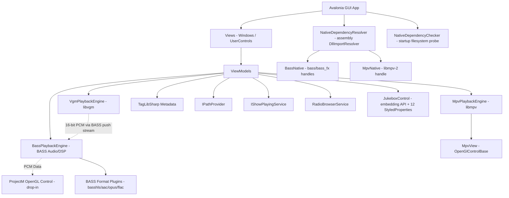

# Jukebox Architecture

This document describes the internal architecture, threading model, native resource lifecycles, plugin/drop-in systems, and key design decisions. It is intended for contributors maintaining the codebase.

---

## 1. Overview

Jukebox is a cross-platform desktop media player built with:

- **Avalonia UI 12.0.5** — cross-platform UI framework (compiled bindings)
- **.NET 10.0 / C# 13** — target framework
- **libmpv** — video playback via custom P/Invoke wrapper, rendered into Avalonia's OpenGL context
- **BASS** + **BASS_FX** — audio playback, DSP, equalizer, and PCM extraction (via `Native/BassNative.cs`)
- **BASS format plugins** — `bassflac`, `bass_aac`, `bassopus`, `basshls`, loaded eagerly at startup to extend BASS's codec coverage
- **libvgm** — VGM/VGZ/VGX emulation (via `Native/VgmNative.cs` + `Services/Playback/VgmPlaybackEngine.cs`, using the custom fork `RobG66/libvgm`)
- **projectM** — optional visualizations, loaded at runtime via reflection against the drop-in `JukeboxVisualizations.dll`
- **TagLibSharp** — background metadata extraction
- **CommunityToolkit.Mvvm** — source-generator-based MVVM (`[ObservableProperty]`, `[RelayCommand]`)
- **AvaloniaUI.DiagnosticsSupport** — Debug-only diagnostics overlay

Two custom local forks of Avalonia's `DataGrid` and `TreeDataGrid` controls are required as sibling `ProjectReference`s. Both must be cloned next to the Jukebox project folder before the build will succeed — see [DEPENDENCIES.md](DEPENDENCIES.md).

| Fork | Expected path | Repository |
|------|---------------|------------|
| DataGrid | `../Avalonia.Controls.DataGrid/` | [RobG66/Avalonia.Controls.DataGrid](https://github.com/RobG66/Avalonia.Controls.DataGrid) |
| TreeDataGrid | `../Avalonia.Controls.TreeDataGrid/` | [RobG66/Avalonia.Controls.TreeDataGrid](https://github.com/RobG66/Avalonia.Controls.TreeDataGrid) |

### Layered Architecture



### Project Layout

```text
Jukebox/
├── Jukebox.slnx                     # New XML solution format (main + 2 fork projects)
├── Jukebox.csproj                   # Project file, package references, fork ProjectReferences
├── Constants.cs                     # Media extensions + named constants
├── Program.cs                       # Entry point, Avalonia app builder
├── App.axaml / App.axaml.cs         # Application lifecycle; registers NativeDependencyResolver
├── app.manifest                     # Windows manifest (supportedOS, transparency, embedding)
├── build.ps1                        # Publish script: win-x64, win-x64-lite, linux-x64 single-file
├── tag-release.ps1                  # Version → git tag → GitHub draft release packager
├── BUILD-INFO.txt                   # Jukebox-Visualizations Linux x64 build provenance
├── ARCHITECTURE.md                  # This file
├── CHANGES.md                       # Keep-a-Changelog
├── DEPENDENCIES.md                  # Native library setup guide
├── EMBEDDING.md                     # Host-app integration guide for JukeboxControl
├── README.md                        # User-facing readme
├── THIRD_PARTY_LICENSES.md          # License inventory
├── Assets/
│   ├── Icons/                       # ~70 PNG icons (transport, playlist, dialogs, OS overlays)
│   └── Buttons/                     # 6 transport button PNGs (prev/play/next/stop/pause/menu)
├── lib/                             # Native runtimes drop-in (gitignored; see DEPENDENCIES.md)
│   └── README.md                    # Required vs optional lib inventory + download links
├── Models/
│   ├── JukeboxTrack.cs              # Track data model (ObservableObject)
│   ├── RadioStation.cs              # Radio station model + NormalizeCountryName
│   ├── SavedPlaylistDto.cs          # Playlist serialization DTO
│   ├── SavedTrackDto.cs             # Track serialization DTO
│   ├── ShowPlayingMode.cs           # OSD mode enum (Off / Briefly / Always)
│   └── ThreeButtonDialogConfig.cs   # Dialog config
├── Helpers/
│   └── CountryNames.cs              # ISO 3166-1 alpha-2 → English short name (249 + XK)
├── Extensions/
│   └── TaskExtensions.cs            # SafeFireAndForget
├── Controls/
│   └── MarqueeTextBlock.cs          # TextBlock + IsPlaying property
├── Converters/
│   ├── BoolToFontStyleConverter.cs        # true → Italic (transient radio slots)
│   ├── OsdLayoutConverters.cs             # OsdMarginConverter + OsdMaxWidthConverter
│   ├── AutoHideMarginConverter.cs         # (IsAutoHide, ControlBarHeight) → Margin
│   └── DoubleToBottomThicknessConverter.cs
├── Styles/                          # 18 .axaml style files (see Section 9 / theme resources)
│   ├── ThemeResources.axaml
│   ├── JukeboxThemeResources.axaml
│   ├── ButtonStyle.axaml
│   ├── TransparentButtonStyle.axaml
│   ├── TileButtonStyle.axaml
│   ├── MenuButtonStyle.axaml
│   ├── NavigationButtonStyle.axaml
│   ├── CheckboxStyle.axaml
│   ├── RadioButtonStyle.axaml
│   ├── ComboBoxStyle.axaml
│   ├── TextBoxStyle.axaml
│   ├── DescriptionTextBoxStyle.axaml
│   ├── NumericUpDownStyle.axaml
│   ├── SliderStyle.axaml
│   ├── GridSplitterStyle.axaml
│   ├── DataGridStyle.axaml
│   ├── ContextMenuStyle.axaml
│   └── CardBorderStyle.axaml
├── Native/
│   ├── BassNative.cs                # BASS P/Invoke + EnsureLoaded + LoadPlugin
│   ├── VgmNative.cs                 # libvgm P/Invoke + EnsureLoaded (no DllImportResolver)
│   └── NativeDependencyResolver.cs  # Assembly-wide DllImportResolver (bass / bass_fx / libmpv-2)
├── Mpv/
│   ├── MpvNative.cs                 # libmpv P/Invoke declarations + ResolveMpv
│   └── MpvContext.cs                # High-level mpv wrapper (events, render context, buffers)
├── Services/
│   ├── Playback/
│   │   ├── BassPlaybackEngine.cs   # Audio playback + EQ + DSP + HttpClient URL streaming + ICY
│   │   ├── MpvPlaybackEngine.cs    # Video playback
│   │   ├── VgmPlaybackEngine.cs    # VGM emulation → BASS push stream
│   │   ├── IMediaPlayerEngine.cs   # Engine abstraction (PlaybackEnded/Started, DurationChanged, MetadataChanged)
│   │   ├── IVisualizerRuntime.cs   # Visualizer abstraction
│   │   └── VisualizerRuntime.cs    # Reflection-based visualizer loader (Expression-compiled delegates)
│   ├── System/
│   │   ├── IPathProvider.cs        # Filesystem paths interface (12 paths)
│   │   ├── PathProvider.cs         # Default path provider
│   │   ├── IStorageService.cs      # File picker interface
│   │   ├── StorageService.cs       # File picker implementation
│   │   ├── IRadioBrowserService.cs # Radio directory interface
│   │   ├── RadioBrowserService.cs  # Radio directory client
│   │   └── NativeDependencyChecker.cs  # Startup filesystem probe (required vs optional)
│   └── UI/
│       ├── IShowPlayingService.cs  # OSD animation interface
│       ├── ShowPlayingService.cs   # OSD animation service
│       ├── IUserDialogService.cs
│       ├── UserDialogService.cs
│       └── ThemeService.cs
├── ViewModels/
│   ├── ViewModelBase.cs
│   ├── JukeboxViewModel.cs              # Main VM (state, OSD, dispose)
│   ├── JukeboxViewModel.Playback.cs     # Playback engine coordination + URL stream lifecycle
│   ├── JukeboxPlaylistViewModel.cs      # Playlist state + filtering
│   ├── JukeboxPlaylistViewModel.Persistence.cs  # Save/load/clear/switch
│   ├── JukeboxPlaylistViewModel.Import.cs       # Add tracks, tag reading
│   ├── JukeboxVisualizerViewModel.cs    # Visualizer preset tree
│   ├── JukeboxVisualizerViewModel.Favorites.cs # Visualizer favorites
│   ├── JukeboxEqViewModel.cs            # 10-band EQ + presets
│   ├── EqSliderViewModel.cs             # Single EQ band VM
│   ├── RadioBrowserViewModel.cs         # Radio station browser
│   ├── VisualizerNodeViewModel.cs       # TreeDataGrid node base
│   ├── VisualizerFolderViewModel.cs     # TreeDataGrid folder node
│   └── VisualizerFileViewModel.cs       # TreeDataGrid file node
└── Views/
    ├── JukeboxView.axaml(.cs)           # Main window + close lifecycle
    ├── JukeboxControl.axaml(.cs)        # Embeddable UserControl: 12 StyledProperties + drag/drop + auto-hide + Escape
    ├── ContentView.axaml(.cs)           # Media host (swaps MpvView/ProjectM)
    ├── MpvView.cs                       # OpenGL control for libmpv
    ├── PlaylistView.axaml(.cs)          # Playlist DataGrids
    ├── TransportBarView.axaml(.cs)      # Play/pause/seek controls
    ├── VisualizerPickerView.axaml(.cs)  # Preset tree picker
    ├── RadioBrowserView.axaml(.cs)      # Radio station search dialog
    ├── TextInputDialogView.axaml(.cs)   # Text input dialog (with default checkbox)
    ├── ThreeButtonDialogView.axaml(.cs) # Confirm/error dialog
    └── RenameDialogView.axaml(.cs)      # File rename dialog
```

---

## 2. Playlist Model

The playlist system uses two separate `ObservableCollection<JukeboxTrack>` instances:

- **`LibraryPlaylist`** — audio and video files (local paths, ZIP entries, VGM files)
- **`RadioPlaylist`** — online radio stations (URL streams)

Each raw collection is wrapped by a `DataGridCollectionView` (`FilteredLibraryPlaylist`, `FilteredRadioPlaylist`) that applies the current search filter, and the filtered views — not the raw collections — are bound to the DataGrids in `PlaylistView.axaml`. There is no shared collection and no URL-type discriminator — tracks are in the right collection by construction. Track transitions (`Next`/`Previous`) are scoped to the active collection: playing the last library track and hitting Next stops (or loops if enabled) rather than jumping to radio.

### Saved Playlists

Playlists are persisted as JSON files under `<PlaylistsDirectory>/Library/` and `<PlaylistsDirectory>/Radio/`. The filename (without extension) is the playlist name.

**Startup behavior:**
- If `Default.json` exists in the Library folder, it is loaded automatically and "Default" is selected in the combobox.
- If no `Default.json` exists, the app starts in a transient state: the combobox shows "Select A Playlist" placeholder text (italic), nothing is selected, and nothing is persisted.
- The same applies to the Radio folder independently.
- The legacy `ActiveLibraryPlaylist.txt` / `ActiveRadioPlaylist.txt` files are no longer read — startup selection is determined solely by whether `Default.json` exists.

**Auto-save:** Changes to a selected playlist (add, remove, clear) are auto-saved to the corresponding JSON file. If no playlist is selected (transient state), nothing is saved — the tracks exist only in memory until the user explicitly saves via "Save As". Users may delete all saved playlists, falling back to the transient state.

**Save As:** The save dialog has an optional "Save as default startup playlist" checkbox. When checked, the text input disables and the name is forced to "Default". Saving as Default makes that playlist load on next startup. Overwrite confirmation is shown if the target file already exists.

### Transient Radio Slots

When a user plays a radio station from the browser without adding it to the playlist, a transient slot is inserted at the top of `RadioPlaylist`. This slot:
- Has `IsTransient = true` (rendered in italic via `BoolToFontStyleConverter`, never persisted to disk)
- Can be promoted to a permanent entry via the "Add to Playlist" pill button
- Is replaced when another station is played from the browser

### Display Behavior

Long track titles in either DataGrid show an ellipsis (`…`) with a tooltip showing the full name. The now-playing speaker icon only indents the currently playing row; other rows use the full column width.

### Version Tracking

Background tag-reading tasks use `_playlistVersion` and `_scrollVersion` counters to detect stale results. Any structural change (`InvalidatePlaylist()`) or scroll-range change increments the counters. Background tasks capture the version at entry and reject their results if the version has changed by the time they complete. `SwitchLibraryPlaylistAsync` and `SwitchRadioPlaylistAsync` both call `InvalidatePlaylist()` to cancel in-flight background tagging tasks when switching playlists. `InitializeAsync` wraps `_isSwitchingPlaylist` in `try/finally` so an exception during init cannot permanently disable playlist switching.

---

## 3. Native Resource Lifecycles

Interfacing with native unmanaged libraries (`libmpv`, `bass.dll`, `bass_fx.dll`, BASS format plugins, `vgm-player`, optionally `libprojectM`) requires strict sequence enforcement during initialization and shutdown. Failure to follow these rules results in `AccessViolationException` or process deadlocks.

**Native library layout:** All native runtimes live under a single flat `<appdir>/lib/` folder. Windows `.dll`, Linux `.so`, and macOS `.dylib` files coexist by extension; each loader picks the right filename per OS at runtime. The `lib/` folder is not shipped in the repo — see [DEPENDENCIES.md](DEPENDENCIES.md).

**DllImportResolver strategy:** The Jukebox assembly has exactly one `DllImportResolver` registered (in `Native/NativeDependencyResolver.cs`, called from `App.Initialize()`). It routes lookups for the names `"bass"`, `"bass_fx"`, and `"libmpv-2"` to the pre-loaded native handles. Because .NET allows only one resolver per assembly, `VgmNative` cannot register its own resolver — it loads `vgm-player` via `NativeLibrary.TryLoad` + `NativeLibrary.GetExport` and resolves function pointers directly into delegates.

### 3.1. libmpv (Video)

- **Custom wrapper:** `Mpv/MpvNative.cs` declares P/Invoke functions via `[DllImport("libmpv-2", CallingConvention = Cdecl)]`. `MpvNative.ResolveMpv(Assembly)` is called by `NativeDependencyResolver` on first P/Invoke. It tries `<appdir>/lib/libmpv-2.dll` (Windows), `libmpv.so.2` (Linux), or `libmpv.2.dylib` (macOS), with `DllImportSearchPath.UseDllDirectoryForDependencies | SafeDirectories` to enable dependent-library resolution from `lib/`. On Linux it additionally falls back to `libmpv.so.1` and `libmpv.so` to support system-package installs. The OS default search path is the final fallback.
- **OpenGL render context:** MPV renders into Avalonia's OpenGL context via `mpv_render_context_create` with `MPV_RENDER_API_TYPE_OPENGL`. `MpvView` (an `OpenGlControlBase` subclass) creates the render context lazily in `OnOpenGlRender` (not `OnOpenGlInit`) — this avoids ordering issues if `MpvContext` is set after the control loads. The view passes `GlInterface.GetProcAddress` as the GL function resolver. No native HWND — no airspace issue.
- **Video decoding:** The core uses `vo=libmpv` (required for the render API) and `hwdec=auto-copy`. Jukebox renders into an Avalonia-owned WGL framebuffer, so direct D3D11/OpenGL interop is not compatible on Windows. Copy mode still offloads decoding while returning frames through system memory; the explicit shared-texture completion barrier prevents presentation flashing.
- **Render context readiness:** `MpvContext` exposes `IsRenderContextReady` and a `TaskCompletionSource`-backed `WaitForRenderContextReadyAsync(int timeoutMs = 3000)`. The completion source runs continuations asynchronously so playback commands cannot continue inline on Avalonia's GL render thread. `MpvView.CreateRenderContext` calls `MarkRenderContextReady()` after the render callback is registered.
- **Render update callback:** MPV calls `mpv_render_context_set_update_callback` when a frame or redraw is needed. The callback (`OnRenderUpdate`) must not call any mpv API — it posts `RequestNextFrameRendering()` to the UI thread. Jukebox does not add another coalescing flag because Avalonia 12's `OpenGlControlBase` already coalesces composition requests and resets its guard before `OnOpenGlRender`, which allows a callback arriving during rendering to queue the required follow-up update.
- **Shared-texture synchronization:** After `mpv_render_context_render`, `MpvView` calls `glFinish()` before Avalonia hands its shared OpenGL texture to the compositor. Avalonia's normal path calls `glFlush()`, which submits commands but does not guarantee cross-context completion; the explicit barrier prevents the compositor from sampling a partially updated texture. Native mpv warnings are requested at `warn` level and forwarded to `Trace` for runtime diagnosis.
- **Pre-allocated render buffers:** `MpvContext` pre-allocates three unmanaged buffers (`_renderParamsPtr`, `_renderFboPtr`, `_renderFlipYPtr`) in `AllocateRenderBuffers()` after `TrySetRenderContext()` and frees them when the GL-owned render context is released. This avoids 180+ `AllocHGlobal`/`FreeHGlobal` pairs per second at 60 fps.
- **First-frame race:** `PlayVideoAsync` calls `WaitForRenderContextReadyAsync()` before `LoadFile` — this blocks until `MpvView` has created the render context. Without this, MPV starts decoding before the render surface exists, producing a black first frame.
- **Event thread:** A background `Thread` calls `mpv_wait_event` in a loop to receive property-change notifications (`time-pos`, `duration`, `eof-reached`). `MpvContext.EventLoop` marshals subscribers off the MPV event thread via `Task.Run(() => PropertyChanged?.Invoke(...))` and `Task.Run(() => EndReached?.Invoke())`; subscribers in `MpvPlaybackEngine` then dispatch to the UI thread themselves. (Note: events do NOT go through `Dispatcher.UIThread.Post` at the `MpvContext` layer.)
- **`MpvEventId` enum:** Properly defined with 24 values. The previous implementation checked event ID 13 for property changes, which is wrong for libmpv 2.x — actual `PropertyChange` is 22.
- **Disposal sequence:** `JukeboxView.CloseAsync` calls `ContentView.DetachMediaHost()` before `DisposePlaybackAsync`, which lets `MpvView.OnOpenGlDeinit` unregister the callback and free the render context while its owning OpenGL context is current. `MpvContext.Dispose()` then cancels, wakes, and joins the mpv event thread before terminating the core handle. Render/update/free operations share `_renderContextLock`, preventing teardown from racing an active frame.

### 3.2. BASS (Audio & DSP)

- **Native loading:** `Native/BassNative.cs::EnsureLoaded()` is the single entry point. It is idempotent (guarded by `_loadAttempted` + `_loadLock`) and is invoked by `NativeDependencyResolver` the first time any `[DllImport("bass")]` or `[DllImport("bass_fx")]` call executes. It builds `libDir = Path.Combine(AppDomain.CurrentDomain.BaseDirectory, "lib")` (hard-coded; not routed through `IPathProvider`), then uses `NativeLibrary.TryLoad` with per-OS filenames produced by `NativeFileName("bass", "libbass")` and `NativeFileName("bass_fx", "libbass_fx")`. The handles are cached as `internal static IntPtr BassHandle` / `BassFxHandle` and returned to the resolver. **Note:** `BassNative.cs` does **not** register a `DllImportResolver` itself — that is done by `NativeDependencyResolver`. The file header comment explains the single-resolver-per-assembly constraint.
- **DSP threading:** BASS processes audio streams and runs DSP procedures (`OnDsp`) on its own unmanaged internal audio thread. The `PcmDataAvailable` event fires on this thread — subscribers must handle thread safety. The DSP callback rate is platform-tuned (see "Platform-specific buffer tuning" below).
- **Race protection:** The BASS stream handle (`_bassStream`) is read by the UI-thread `PlaybackTimer_Tick` (via `Bass.ChannelGetPosition`) and freed by `Dispose()` on the close path. Both run on the UI thread — `PlaybackTimer_Tick` fires from a `DispatcherTimer`, and `DisposePlaybackAsync` runs on the UI thread during window close. The timer is stopped before `Dispose()` is called.
- **DSP callback race:** During shutdown, `PcmDataAvailable` is nulled on the UI thread. To prevent a `NullReferenceException` if the field is nulled between the null-check and the `Invoke` call, `OnDsp` uses the local-copy pattern: `var handler = PcmDataAvailable; if (handler != null) handler.Invoke(...)`. `Dispose()` also calls `Bass.ChannelRemoveDSP` and `Bass.ChannelRemoveSync` (end-sync + ICY-meta sync) before `Bass.StreamFree` to drain in-flight callbacks. `BassNative.Free()` is only called when `_ownsBassContext` is true.
- **Equalizer:** Uses BASS_FX `PeakEQ` (cross-platform, requires `bass_fx.dll` / `libbass_fx.so` / `libbass_fx.dylib` in `lib/`). A single FX handle is attached to the active stream; 10 bands are multiplexed via the `lBand` field. `InitializeEqBands(double[] gains, float[] centerFrequencies)` must be called after `PlayAsync` creates the stream — it guards on `_bassStream != 0`. `UpdateEqBand(int index, double gain, float centerFrequency)` updates one band's `fGain`/`fCenter` via `BASS_FXSetParameters`.
- **Stream creation failure:** If `Bass.CreateStream` returns `0`, `Bass.LastError` is read and surfaced via `ThreeButtonDialogView.ShowErrorAsync`. The same dialog is used to report missing-plugin errors (e.g. `basshls.dll` / `libbasshls.so` is absent and the user tries to play an `.m3u8` stream).
- **HttpClient-based URL streaming:** BASS's built-in HTTP client stops reading after ~32 KB when a server sends `Connection: close` (which StreamTheWorld/Triton MediaGateway and some CDNs do). `BassPlaybackEngine.OpenUrlStreamAsync` opens the HTTP connection via `HttpClient`, then hands the response stream to BASS via `BASS_StreamCreateFileUser` with custom `BASS_FILEPROCS` (close/length/read/seek). BASS detects the audio format (AAC, MP3, Opus, HLS via `basshls`) and decodes through the normal pipeline — EQ, visualizations, and ICY metadata all work.
- **ICY metadata parsing:** For URL streams, `BassPlaybackEngine` reads the `icy-metaint` response header, counts bytes via `_icyBytesUntilMeta`, and extracts `StreamTitle='...'` blocks in `ConsumeIcyMetadataBlock`. The parsed title fires the `MetadataChanged` event, which the VM forwards to the OSD. The `BASS_SYNC_METADATA` sync is wired but never fires for URL streams (those go through `StreamCreateFileUser`, which has no native ICY awareness) — it is left in as a harmless no-op.
- **Platform-specific buffer tuning:** Linux uses `PlaybackBufferLength = 1000 ms` + `UpdatePeriod = 50 ms` to prevent PipeWire/PulseAudio ALSA stutter. Windows uses `UpdatePeriod = 30 ms` (visualizer flicker fix; ~33 DSP callbacks/sec to match 60 fps render). These tuning values directly control the rate at which PCM is fed to the visualizer.
- **Stream cancellation:** `BassPlaybackEngine.SetStreamCancellationToken(CancellationToken)` links an external cancellation token (from `JukeboxViewModel._streamConnectCts`) into the `HttpClient.SendAsync` call inside `OpenUrlStreamAsync`, so a newer `StartTrackAsync` can abort an in-flight connection.

### 3.3. libvgm (VGM Emulation)

- **C API shim:** libvgm is C++ and exposes class-based interfaces. Jukebox uses the `RobG66/libvgm` fork (`https://github.com/RobG66/libvgm`) which includes a custom flat C API shim wrapper (`vgm-player` / `libvgm-player.so`) that translates `PlayerA` and sound core operations into C-style flat functions suitable for P/Invoke mapping.
- **Loading:** `Native/VgmNative.cs::EnsureLoaded()` is idempotent (guarded by `_loadAttempted` + `_loadLock`). It calls `NativeLibrary.TryLoad(fullPath, typeof(VgmNative).Assembly, DllImportSearchPath.SafeDirectories | DllImportSearchPath.UseDllDirectoryForDependencies, out _libHandle)`. The `UseDllDirectoryForDependencies` flag is what lets Windows find `vgm-emu_*.dll` and `vgm-utils_*.dll` as dependencies in the same `lib/` folder. It falls back to the OS default search path if `lib/` doesn't have it. Candidate filenames come from `GetCandidateLibraryNames()`:
  - Windows: `vgm-player.dll`, `vgm-player_Win64.dll`
  - Linux: `libvgm-player.so`, `libvgm-player.so.1`
  - macOS: `libvgm-player.dylib`
- **No DllImportResolver:** `VgmNative` does **not** call `SetDllImportResolver` — the file header explicitly notes that `MpvNative` (via `NativeDependencyResolver`) has already taken the single resolver slot for this assembly, and .NET allows only one per assembly. Instead, function exports are resolved eagerly via `NativeLibrary.GetExport(handle, name)` + `Marshal.GetDelegateForFunctionPointer<T>` into 16 static delegate fields (`_create`, `_destroy`, `_setOutput`, `_setVolume`, `_setLoopCount`, `_loadFile`, `_loadMemory`, `_start`, `_stop`, `_pause`, `_unload`, `_render`, `_getPosition`, `_getTotal`, `_isPlaying`, `_seek`). A `PlayerHandle : SafeHandle` wrapper class manages the unmanaged player handle lifetime.
- **Public surface:** `CreatePlayer`, `SetOutput`, `SetVolume`, `SetLoopCount`, `LoadFile`, `LoadMemory`, `Start`, `Stop`, `Pause`, `Unload`, `Render`, `GetPositionSamples`, `Seek`, `GetTotalSamples`, `IsPlaying`, `IsAvailable()`. `IsAvailable()` calls `EnsureLoaded()` then checks `_libHandle != IntPtr.Zero && _create != null`.
- **Audio rendering:** `VgmPlaybackEngine` starts a dedicated background thread that pulls 16-bit stereo 44100 Hz PCM from libvgm and writes it into a BASS push stream (`Bass.StreamPutData`). This routes VGM audio through the standard BASS pipeline, automatically supporting EQ, DSP, and visualizations. The VGM engine mirrors the BASS API: `PcmDataAvailable` event, `InitializeEqBands`/`UpdateEqBand`, `LoopInfinite` property.
- **Initialization caveat:** `VgmPlaybackEngine` is constructed in the `JukeboxViewModel` constructor, but its `Initialize()` method is **not** invoked from `JukeboxViewModel.InitializeBackendAsync` (only `_bassEngine.Initialize()` and `_mpvEngine.Initialize()` are). The VGM engine is selected by `StartTrackAsync` for `.vgm`/`.vgz`/`.vgx` files when `VgmEngine.IsAvailable` is true; otherwise the file falls through to BASS (which cannot play it). This is a known latent gap — see `JukeboxViewModel.Playback.cs` `InitializeBackendAsync` for the wiring point if VGM initialization should be eager.
- **Stale doc reference:** `VgmPlaybackEngine.cs` header comment contains `<see cref="VgmRipsCatalogueService.DownloadVgzAsync"/>`. That class does not exist anywhere in the codebase — the reference should be removed or the service implemented.

### 3.4. ProjectM (Optional Visualizations)

- **Optional drop-in:** The `JukeboxVisualizations` assembly is discovered at runtime via reflection in `Services/Playback/VisualizerRuntime.cs`. If absent, `IsVisualizerAvailable` is `false`, the visualizer button is hidden, and audio plays without any ProjectM dependency. Discovery is **lazy** — the probe runs on the first call to `CreateControl()`, `StartEngine()`, `LoadPreset()`, or `FeedPcm()`, not at startup.
- **Singleton + test override:** `VisualizerRuntime.Current` is a double-checked singleton (`_override ?? (_current ??= new VisualizerRuntime(PathProvider.Current))`). `VisualizerRuntime.Override(IVisualizerRuntime?)` and `VisualizerRuntime.Reset()` allow test-wide replacement. `JukeboxViewModel.VisualizerRuntime` is also a public settable instance-level property for per-VM substitution.
- **Availability check caveat:** `IsAvailable` only checks `Directory.Exists(_pathProvider.ProjectMPresetsDirectory)`. It does **not** verify `JukeboxVisualizations.dll` exists. If the presets folder is present but the DLL is missing, `IsAvailable` returns `true` while `CreateControl()` returns `null`, and the visualizer silently fails to attach. `JukeboxViewModel.IsVisualizerAvailable` is then `VisualizerRuntime.IsAvailable && !IsVisualizerDisabled` — so a missing-DLL state is invisible to the VM. The DLL existence check happens inside `Probe()`.
- **Probe sequence (`Probe()`):**
  1. `Directory.Exists(_pathProvider.ProjectMPresetsDirectory)` — return early if missing.
  2. `File.Exists(_pathProvider.JukeboxVisualizationsDllPath)` — return early if missing.
  3. `Assembly.LoadFrom(dllPath)` — loads the managed wrapper.
  4. `_assembly.GetType("JukeboxVisualizations.Controls.ProjectMControl")` — locates the control type.
  5. `GetMethod` for `StartEngine`, `LoadPreset(string, bool)`, `LoadPresetData(string, bool)` (optional), `FeedPcm(short[])`.
  6. **Build compiled `Expression` delegates** — NOT `MethodInfo.Invoke`, NOT `Delegate.CreateDelegate`. The code comments why: *Delegate.CreateDelegate fails because `Control` is a base type of `ProjectMControl`, which violates delegate parameter covariance/type safety. Using `Expression.Lambda<Action<...>>().Compile()` allows the control parameter to be cast and produces direct-call typed delegates.* This avoids per-call boxing/array-allocation on the real-time audio thread. Stored as `_startEngineAction`, `_loadPresetAction`, `_loadPresetDataAction`, `_feedPcmAction`.
- **GL thread affinity:** `ProjectMControl` inherits from `OpenGlControlBase`. Preset loading (`projectm_load_preset_data`) and rendering (`projectm_opengl_render_frame`) must only occur on the OpenGL render thread inside `OnOpenGlRender`.
- **PCM queueing:** PCM data from BASS's audio thread is passed to the GL render thread via a `ConcurrentQueue<short[]>` inside `ProjectMControl`. `FeedPcm(Control, short[])` invokes the cached delegate; errors are logged only once per session via `_feedPcmErrorLogged` to avoid log spam at ~33 Hz.
- **Preset loading (`LoadPreset(Control, string presetPath)`):** Heavy implementation:
  - Cancels any in-flight load via `_presetLoadCts` (SemaphoreSlim serialization).
  - Runs on `Task.Run` to keep file IO off the UI thread.
  - Creates `CurrentPresetDirectory` if missing.
  - Detects if preset is already in `current_preset/` (skips self-copy).
  - Cleans stale files from `current_preset/` if loading from elsewhere.
  - Reads file, normalizes `\r\n` → `\n` for libprojectM's Linux parser.
  - Writes normalized content to `current_preset/<filename>` for restore-on-next-launch.
  - Copies referenced textures (jpg/png/bmp/tga) — detected via static compiled `TextureFileRegex`.
  - Posts to UI thread: prefers `LoadPresetData(content, smooth)` (avoids duplicate file read inside `ProjectMControl`); falls back to `LoadPreset(path, smooth)`.
  - Multiple nested fallbacks with `Debug.WriteLine` logging.
- **FBO hooking:** libprojectM natively targets FBO 0 (the default window backbuffer). Avalonia renders custom controls into private non-zero FBOs. The wrapper hooks `__glewBindFramebuffer` in `glew32.dll` and redirects FBO 0 bindings to Avalonia's offscreen FBO during `projectm_opengl_render_frame`.
- **No unload mechanism:** The loaded `Assembly` stays loaded for the process lifetime — there is no `AssemblyLoadContext`-based unload. Only the `Control` instance is `TryDispose`'d when `ContentView.OnUnloaded` fires. `TryDispose` defensively checks `is IDisposable` before calling `Dispose()` (ProjectMControl currently does NOT implement IDisposable, but the wrapper future-proofs).
- **Window-resize suppression:** `JukeboxControl` subscribes to the host window's `Width`/`Height` property changes. On resize, `ContentView.NotifyWindowResizing()` calls `SuppressNativeRenderDuringLayoutTransition()` which sets `_projectMControl.IsVisible = false` to prevent per-frame GL surface resizes (stutter fix). A 250 ms `DispatcherTimer` restores visibility on settle.

### 3.5. Single OpenGL Control

`ContentView` uses a `ContentControl` (`MediaHost`) that swaps between three states:
- **`MpvView`** — video mode
- **`ProjectMControl`** — audio mode with visualizer available
- **Empty** — audio mode without visualizer

Only one `OpenGlControlBase` is in the visual tree at a time. Each creates its own private GL context, and having two simultaneously breaks ProjectM initialization. When switching modes, the old control is removed (`MediaHost.Content = null`), triggering `OnOpenGlDeinit` and GL context cleanup, before the new control is attached. The mode swap is driven by `JukeboxViewModel.IsVisualizerVisible`, which is set by `StartTrackAsync` based on whether the active track is audio (true) or video (false).

### 3.6. Plugin & Drop-in Architecture

Jukebox has **five distinct plugin/drop-in mechanisms**, each with its own loading strategy, error handling, and OS-specific filename resolution. They are consolidated here for clarity.

| Plugin type | Load trigger | Loader mechanism | Missing-plugin behavior | OS-specific filename resolution |
|---|---|---|---|---|
| `bass.dll` / `bass_fx.dll` core | `BassPlaybackEngine.Initialize()` → `BassNative.EnsureLoaded()` (via `NativeDependencyResolver`) | `NativeLibrary.TryLoad` + assembly DllImportResolver | Engine unavailable; no audio. Surfaced by `NativeDependencyChecker` at startup. | `NativeFileName("bass", "libbass")` helper (3 OS branches) |
| `basshls` / `bass_aac` / `bassopus` / `bassflac` format plugins | `BassPlaybackEngine.Initialize()` after `Bass_Init` | `BassNative.LoadPlugin(path)` → `NativeLibrary.TryLoad` + `BASS_PluginLoad` | **Silent.** Specific format/protocol fails when played; error dialog only at play time. NOT checked by `NativeDependencyChecker`. | Inline `IsWindows ? ".dll" : ".so"` — **no macOS `.dylib` branch** |
| `libmpv-2` | `NativeDependencyResolver` (lazy, on first P/Invoke) | `MpvNative.ResolveMpv` → `NativeLibrary.Load` + assembly DllImportResolver | Engine unavailable; no video. Surfaced by `NativeDependencyChecker` (Linux system-path fallback via `IsLibraryOnSystemPath`). | Inline 3-OS branches + fallback to `libmpv.so.1` / `libmpv.so` on Linux |
| `vgm-player` | `VgmPlaybackEngine.Initialize()` (currently uncalled from `InitializeBackendAsync`) | `VgmNative.EnsureLoaded` → `NativeLibrary.TryLoad` + `GetExport` into delegates | VGM files fall through to BASS (which cannot play them). NOT checked by `NativeDependencyChecker`. | `GetCandidateLibraryNames()` (3 OS branches) |
| `JukeboxVisualizations.dll` (managed wrapper around `libprojectM`) | Lazy on first `CreateControl` / `StartEngine` / `LoadPreset` / `FeedPcm` | `Assembly.LoadFrom` + Expression-compiled delegates | `IsAvailable` only checks presets dir, not DLL — silent failure mode if DLL missing. NOT checked by `NativeDependencyChecker`. | Same filename on all platforms (managed IL) |

#### 3.6.1. BASS format plugins (`basshls`, `bass_aac`, `bassopus`, `bassflac`)

Core BASS only supports MP3, OGG, WAV, and AIFF. At startup, `BassPlaybackEngine.Initialize()` eagerly and unconditionally loads the four format plugins in this exact order:

```csharp
BassNative.LoadPlugin(Path.Combine(libDir, IsWindows ? "basshls.dll"  : "libbasshls.so"));
BassNative.LoadPlugin(Path.Combine(libDir, IsWindows ? "bass_aac.dll" : "libbass_aac.so"));
BassNative.LoadPlugin(Path.Combine(libDir, IsWindows ? "bassopus.dll" : "libbassopus.so"));
BassNative.LoadPlugin(Path.Combine(libDir, IsWindows ? "bassflac.dll" : "libbassflac.so"));
```

`libDir` is hard-coded as `Path.Combine(AppDomain.CurrentDomain.BaseDirectory, "lib")` — not routed through `IPathProvider.NativeLibDirectory`. (This is an inconsistency vs the rest of the codebase and is flagged for cleanup.)

`BassNative.LoadPlugin(string absolutePath)`:
1. `File.Exists(absolutePath)` check — returns `0` silently if missing (no exception, no log).
2. `NativeLibrary.TryLoad(absolutePath, out _)` — pre-loads the DLL into the process address space so the OS linker finds it regardless of working directory. The handle is discarded; BASS manages its own handle internally.
3. Calls `BASS_PluginLoad` via P/Invoke. Two overloads:
   - `_PluginLoadW(string, int)` with `CharSet.Unicode` (Windows)
   - `_PluginLoadA([LPStr]string, int)` (Linux/macOS)
   - The wrapper `_PluginLoad(file, flags)` picks based on `RuntimeInformation.IsOSPlatform(OSPlatform.Windows)`.
   - Flags: `BASS_UNICODE` (`0x80000000`) on Windows, `0` elsewhere.
4. On success returns the BASS plugin handle (>0). On failure returns `0` and logs `BASS failed to register plugin: <path>. Error: <code>` via `Debug.WriteLine`.

**Missing-plugin behavior:** Silent at startup — no user-facing dialog. Each missing plugin means certain formats won't play (e.g. `.flac` files fail to open via `BassNative.CreateStream` if `bassflac` isn't registered; HLS radio URLs fail if `basshls` isn't registered). The error surfaces as a `BassErrors.FileFormat` (= 41) or similar from `BassNative.GetLastError()` when the user tries to play such a file — at that point the user gets a `ThreeButtonDialogView.ShowErrorAsync` dialog mentioning `basshls.dll` / `libbasshls.so`.

**macOS asymmetry:** The four format plugins have no `.dylib` branch — the inline ternary only covers Windows and Linux. This is a known asymmetry; macOS support for these plugins is currently unimplemented.

**When called:** At startup, inside `BassPlaybackEngine.Initialize()`, which is invoked from `JukeboxViewModel.InitializeBackendAsync()` running on a `ThreadPool` thread (`await Task.Run(() => { _bassEngine.Initialize(); _mpvEngine.Initialize(); })`). Plugin loading does not block the UI thread.

#### 3.6.2. projectM / `JukeboxVisualizations.dll` drop-in

See Section 3.4 for the full lifecycle. The drop-in consists of:
- `<appdir>/ProjectM/presets/` — `.milk` preset files (presence is what `IsAvailable` checks)
- `<appdir>/ProjectM/textures/` — preset-referenced textures
- `<appdir>/lib/JukeboxVisualizations.dll` — managed wrapper (loaded by `Assembly.LoadFrom`)
- `<appdir>/lib/JukeboxVisualizations.deps.json` — dependency manifest
- `<appdir>/lib/libprojectM.dll` / `libprojectM.so.4` / `libprojectM.dylib` — native visualizer
- `<appdir>/lib/glew32.dll` — Windows-only, required by `libprojectM.dll`
- `<appdir>/lib/libprojectM-LICENSE.txt`

Source: [RobG66/Jukebox-Visualizations](https://github.com/RobG66/Jukebox-Visualizations).

---

## 4. Threading & Asynchronous Processing

### 4.1. Virtualized Metadata Tagging

When directories with thousands of tracks are loaded, parsing metadata for all files instantly would freeze the UI.

- Tracks are initially loaded with placeholder metadata
- The `DataGrid` notifies the VM of the visible index range (`NotifyVisibleRange`)
- `TagVisibleRangeAsync` reads tags in batches of 5 (`Constants.TagBatchSize`) on background ThreadPool threads
- A scroll debounce timer (`Constants.ScrollDebouncePollMs` = 50 ms poll, `Constants.ScrollIdleMs` = 500 ms idle threshold) coalesces rapid scroll notifications before triggering a tag refresh
- Version counters (`_playlistVersion`, `_scrollVersion`) prevent stale background results from writing to the wrong tracks
- `DiscoverFiles` uses `EnumerationOptions { IgnoreInaccessible = true }` so permission-denied directories don't abort the scan

### 4.2. Fire-and-Forget Observation

`TaskExtensions.SafeFireAndForget(this Task, string operationName)` captures and logs exceptions from fire-and-forget async work via `Debug.WriteLine`:

```csharp
DisposePlaybackAsync().SafeFireAndForget(nameof(DisposePlaybackAsync));
```

The method uses `ContinueWith` with `TaskContinuationOptions.None` and logs via `Debug.WriteLine("[SafeFireAndForget] {operationName} failed: {exception.Flatten().Message}")`. It returns `void` (not `Task`), so it must be called as a statement — never assigned to `_ =`.

### 4.3. Async Initialization

File IO never runs inside a ViewModel constructor. VMs expose async `InitializeAsync()` / `LoadAsync()` methods called from the View's `Loaded` handler:

```csharp
// In JukeboxView.OnLoaded:
vm.InitializeBackendAsync().SafeFireAndForget(nameof(vm.InitializeBackendAsync));
vm.VisualizerViewModel.LoadVisualizersAsync().SafeFireAndForget(nameof(vm.VisualizerViewModel.LoadVisualizersAsync));
vm.VisualizerViewModel.InitializeAsync().SafeFireAndForget(nameof(vm.VisualizerViewModel.InitializeAsync));
vm.EqViewModel.LoadAsync().SafeFireAndForget(nameof(vm.EqViewModel.LoadAsync));
```

`InitializeBackendAsync` runs BASS + MPV engine init on a `ThreadPool` thread, then updates VM state on the UI thread, then fires `InitializeStartupAsync` (which applies `InitialVolume`, `InitialFile`, etc.) as fire-and-forget.

### 4.4. EQ Settings Persistence

`JukeboxEqViewModel` uses a 300 ms `DispatcherTimer` debounce: each `Gain` change restarts the timer, and only the final change in the window triggers an async `SaveEqSettingsAsync()` via `Task.Run`.

### 4.5. URL Stream Connection Lifecycle

When a radio station URL is played, `JukeboxViewModel.Playback.cs::StartTrackAsync` runs a connection race:

1. A `_streamConnectCts` `CancellationTokenSource` is created (and any prior one is cancelled — superceded-by-newer-call semantics).
2. The token is handed to `BassPlaybackEngine.SetStreamCancellationToken`, which links it into the `HttpClient.SendAsync` call inside `OpenUrlStreamAsync`.
3. For HTTP(S) sources, `IsConnecting = true` + `ConnectingMessage = "Connecting to host…"` drives the connection overlay before plugin URL resolution and remains set while the resolved media URL is opened.
4. `PlayAsync` is awaited; the `PlaybackStarted` event on the engine is the success signal.
5. If `PlaybackStarted` does not fire within the applicable timeout (15 s for live audio, 20 s for seekable remote video), the connection is aborted and a `ThreeButtonDialogView.ShowErrorAsync` is shown.
6. If a newer `StartTrackAsync` cancels the token first, the loser silently bails without any user-facing dialog.

### 4.6. Engine Routing

`StartTrackAsync` selects the playback engine per track:

| Track type | Engine | Notes |
|---|---|---|
| URL ending in `.pls` or `.ashx` | `MpvPlaybackEngine` | MPV handles playlist-file + ashx redirects better than BASS's HTTP client |
| Other URL (http://, https://) | `BassPlaybackEngine` | Goes through `OpenUrlStreamAsync` + `BASS_StreamCreateFileUser` |
| Local `.vgm` / `.vgz` / `.vgx` | `VgmPlaybackEngine` (if `IsAvailable`) | Falls through to BASS if VGM not initialized — currently always falls through |
| Local audio extension (`.mp3`, `.flac`, …) | `BassPlaybackEngine` | See `Constants.AudioExtensions` |
| Local video extension (`.mp4`, `.mkv`, …) | `MpvPlaybackEngine` | See `Constants.VideoExtensions` |

After engine selection, `IsVisualizerVisible` is set to `isAudio`, which drives the `ContentView` mode swap (Section 3.5).

---

## 5. Window Close Lifecycle

The close sequence is designed to never block the UI thread on native teardown, capture and log disposal failures instead of crashing, and bound the wait so a misbehaving backend cannot hang the close.

```
[User clicks close]
       │
       ▼
[JukeboxView.OnClosing] (synchronous — sets e.Cancel = true, flags _isClosing)
       │
       ▼
[CloseAsync()] (private async Task, runs on UI thread)
       │
       ├─► ContentView.DetachMediaHost()
       │       └─► MediaHost.Content = null → removes MpvView/ProjectMControl
       │           └─► Triggers OnOpenGlDeinit → GL context cleanup
       │
       ├─► await vm.DisposePlaybackAsync()
       │       .WaitAsync(TimeSpan.FromMilliseconds(Constants.DisposeTimeoutMs))
       │       ├─► Stop playback timer
       │       ├─► Unsubscribe events
       │       ├─► _bassEngine.Dispose()  (synchronous)
       │       ├─► _mpvEngine.Dispose()   (synchronous)
       │       └─► VgmEngine?.Dispose()   (synchronous)
       │
       ├─► catch (TimeoutException) { log; close anyway }
       ├─► catch (Exception)        { log; close anyway }
       │
       ▼
[Window.Close()]
```

**Key invariants:**
- `OnClosing` is synchronous — it cannot throw exceptions that escape to `async void`
- `DisposePlaybackAsync` is awaited with a 3-second timeout (`Constants.DisposeTimeoutMs`)
- The playback timer is stopped before engine disposal (both run on the UI thread, serialized by the message pump)
- `ContentView` is located by name (`ContentViewChild`) or by visual-tree walk if the named lookup fails

---

## 6. Service Layer

### 6.1. IPathProvider

Single source of truth for all canonical filesystem paths. `PathProvider.Current` returns the default instance; tests can override via `PathProvider.Override(stub)`. All paths are rooted at `AppBaseDirectory` (= `AppDomain.CurrentDomain.BaseDirectory`), making Jukebox fully portable — no OS user-profile folders are used.

| Path | Resolves to | Purpose |
|---|---|---|
| `AppBaseDirectory` | `AppDomain.CurrentDomain.BaseDirectory` | Root for all relative paths |
| `NativeLibDirectory` | `<appdir>/lib` | All native runtimes + `JukeboxVisualizations.dll` |
| `ProjectMRoot` | `<appdir>/ProjectM` | Visualizer data root |
| `ProjectMPresetsDirectory` | `<ProjectM>/presets` | `.milk` preset files; `IsAvailable` checks this exists |
| `ProjectMFavoritesDirectory` | `<ProjectM>/presets/Favorites` | User's favorited presets |
| `CurrentPresetDirectory` | `<ProjectM>/current_preset` | Copy of currently-loaded preset for restore-on-next-launch |
| `JukeboxVisualizationsDllPath` | `<lib>/JukeboxVisualizations.dll` | Path probed by `VisualizerRuntime.Probe()` |
| `SettingsDirectory` | `<appdir>/Settings` | User settings root |
| `EqSettingsFile` | `<Settings>/EqSettings.json` | EQ band gains + active preset |
| `PlaylistsDirectory` | `<appdir>/Playlists` | Playlist root |
| `CacheDirectory` | `<appdir>/Cache` | Transient cache root |
| `RadioStationsCacheFile` | `<Cache>/RadioStationsCache.json` | Cached radio station list |

### 6.2. IShowPlayingService

Encapsulates the "Now Playing" OSD animation: hold at full opacity, then fade. The VM subscribes to `Changed` and forwards state to observable properties for XAML binding. `ShowAsync` can be called from any thread (dispatched to UI thread internally).

The OSD has three modes (enum `ShowPlayingMode` in `Models/ShowPlayingMode.cs`):
- **`Off`** — never shown
- **`Briefly`** — shown for `ShowPlayingTimeout` seconds (default 10), then fades
- **`Always`** — shown persistently while a track is playing

`CycleShowPlayingMode` rotates `Off → Briefly → Always → Off`. `ShowPlayingModeTooltip` and `ShowPlayingModeBrush` are computed properties that drive the toolbar icon color/tooltip.

### 6.3. IStorageService

File-open and folder-open picker dialogs. The default `StorageService` takes a `Window` reference for showing Avalonia storage pickers. When embedding `JukeboxControl` in a host app, the host must inject a `StorageService` if file dialogs are needed.

### 6.4. NativeDependencyChecker

`Services/System/NativeDependencyChecker.cs` performs a **filesystem-only** probe at startup — it does NOT load any libraries, just `File.Exists` per platform-specific filename. Called from `App.OnFrameworkInitializationCompleted()` after the main window is created. If the report is non-null, it is shown via `ThreeButtonDialogView.ShowErrorAsync` deferred to `DispatcherPriority.Loaded` so it appears on top of the main window. The app continues to start (so the user can read the message), but audio/video won't work until the missing files are placed.

**Required** (block playback if missing):
- `bass.dll` / `libbass.so` / `libbass.dylib`
- `bass_fx.dll` / `libbass_fx.so` / `libbass_fx.dylib`
- `libmpv-2.dll` (Windows) / `libmpv.so.2` (Linux — skipped if found on system path via `IsLibraryOnSystemPath`, which also probes `libmpv.so.1` and `libmpv.so`) / `libmpv.2.dylib` (macOS)

**Optional** (only affect visualizer):
- `JukeboxVisualizations.dll` (same filename on all platforms)
- `libprojectM.dll` / `libprojectM.so.4` / `libprojectM.dylib`
- `glew32.dll` (Windows only — libprojectM Windows dependency)

**NOT checked at all** (truly optional, no startup report):
- `bassflac` / `bass_aac` / `bassopus` / `basshls` — failure surfaces only when the user tries to play a file of that format
- `vgm-player` / `libvgm-player.so` — failure surfaces only when the user tries to play a VGM file

### 6.5. NativeDependencyResolver

`Native/NativeDependencyResolver.cs` registers the single assembly-wide `DllImportResolver` for the Jukebox assembly. Called from `App.Initialize()` — **before** any playback engine is constructed.

```csharp
internal static class NativeDependencyResolver
{
    public static void Register()  // called from App.Initialize()
    {
        NativeLibrary.SetDllImportResolver(typeof(NativeDependencyResolver).Assembly, ResolveDll);
    }

    private static IntPtr ResolveDll(string name, Assembly assembly, DllImportSearchPath? searchPath)
    {
        if (name == "bass")     { BassNative.EnsureLoaded(); return BassNative.BassHandle; }
        if (name == "bass_fx")  { BassNative.EnsureLoaded(); return BassNative.BassFxHandle; }
        if (name == "libmpv-2") { return MpvNative.ResolveMpv(assembly); }
        return IntPtr.Zero;
    }
}
```

This is why `VgmNative` cannot register its own resolver — .NET allows only one `DllImportResolver` per assembly, and `NativeDependencyResolver` has taken the slot.

### 6.6. JukeboxControl Embedding API

`Views/JukeboxControl.axaml(.cs)` is the embeddable surface for host Avalonia applications. The architecture extends well beyond "Main UserControl + drag/drop":

**12 StyledProperties** (mirror the standalone command-line switches):

| Property | Type | Default | Mirrors switch |
|---|---|---|---|
| `InitialFile` | `string?` | `null` | `-file` |
| `PlaylistLogo` | `string?` | `null` | `-playlistlogo` |
| `InitialVolume` | `int` | `100` | `-volume` |
| `IsRandomPlayback` | `bool` | `false` | `-random` |
| `IsLoopEnabled` | `bool` | `false` | `-loop` |
| `IsAutoHideEnabled` | `bool` | `false` | `-hidecontrols` |
| `IsControlsDisabled` | `bool` | `false` | `-nocontrols` |
| `IsVisualizerDisabled` | `bool` | `false` | `-novisualizer` |
| `IsShowPlayingEnabled` | `bool` | `true` | `-showplaying` |
| `ShowPlayingTimeout` | `int` | `10` | `-showplaying [timeout]` |
| `IsVisualizerRandomizerEnabled` | `bool` | `false` | `-randompreset` |
| `VisualizerRandomizerIntervalSeconds` | `int` | `10` | `-randompreset [time]` |

**Behaviors wired up in code-behind:**
- **Drag/drop** — `DragDrop.SetAllowDrop(this, true)` + `DragOver`/`Drop` handlers (bubble). Filters to `DataFormat.File` only. Extracts `IStorageItem.Path.LocalPath`, calls `vm.PlaylistViewModel.ProcessAndAddFilesAsync(paths, vm.NoRecurse)`. Auto-plays first dropped item only if nothing is currently playing.
- **Inactivity auto-hide** — `DispatcherTimer` at `Constants.ControlBarInactivitySeconds` (5 s). On tick, sets `vm.ControlBarHeight = Constants.HiddenControlBarHeight` (0) if `IsAutoHideEnabled && !IsControlsDisabled`. Reset on `PointerMoved`/`PointerEntered`.
- **Window-resize subscription** — `OnLoaded` captures `_hostWindow = topLevel as Window` and subscribes to `PropertyChanged`. On `Width`/`Height` change, calls `contentView.NotifyWindowResizing()` → triggers `SuppressNativeRenderDuringLayoutTransition()` (Section 3.4). 250 ms `DispatcherTimer` restores visibility on settle.
- **Tunneled KeyDown handler** — `topLevel.AddHandler(InputElement.KeyDownEvent, OnPreviewKeyDown, RoutingStrategies.Tunnel)`. `Escape` closes open panels (playlist/picker/EQ) or exits fullscreen. Honors `IsControlsDisabled`.
- **`OnPropertyChanged` override** — forwards StyledProperty changes to the underlying `JukeboxViewModel` properties, handling both `DataContext` change and live property change cases.

See [EMBEDDING.md](EMBEDDING.md) for the host-app integration guide.

---

## 7. Constants

All magic numbers and shared constants live in the `Constants` static class (`namespace Jukebox`). ViewModels and Views reference them as `Constants.X` without a `using` statement (child namespaces inherit).

**Timing & UI:**
- `PlaybackTimerIntervalMs` = 250 — UI timer tick for position updates
- `OsdHoldMs` = 3000, `OsdFadeSteps` = 60, `OsdStartOpacity` = 0.7 — OSD animation
- `DefaultControlBarHeight` = 65, `HiddenControlBarHeight` = 0 — transport bar height (px)
- `ControlBarInactivitySeconds` = 5 — inactivity period before auto-hide
- `SidePanelWidth` = 430 — width of slide-out side panels (px)
- `ScrollIdleMs` = 500, `ScrollDebouncePollMs` = 50 — virtualized-tagging scroll debounce

**Audio / EQ:**
- `EqBandCount` = 10 — must match EQ array sizes
- `EqSettingsFileName` = `"EqSettings.json"` — composed with `SettingsDirectory` by `PathProvider.EqSettingsFile`

**Virtualized tagging:**
- `TagBatchSize` = 5, `TagAllThreshold` = 100 — virtualized tagging

**Native lifecycle:**
- `DisposeTimeoutMs` = 3000 — max wait for playback disposal on close
- `StreamConnectionTimeoutMs` = 15000 — radio stream connection timeout
- `RemoteVideoConnectionTimeoutMs` = 20000 — seekable remote video connection timeout

**Media extensions:**
- `AudioExtensions` = `{ ".mp3", ".flac", ".wav", ".ogg", ".m4a", ".wma", ".vgz", ".vgm", ".vgx", ".zip" }` — recognized audio file extensions (includes VGM + ZIP)
- `VideoExtensions` = `{ ".mp4", ".mkv", ".avi", ".webm" }` — recognized video file extensions
- `SupportedMediaExtensions` — case-insensitive `HashSet<string>` combining the above; used by file pickers + drag/drop filter

---

## 8. Testability

ViewModels have optional constructor overloads for injecting mock services:

```csharp
// Production
public JukeboxViewModel()  →  new ShowPlayingService()

// Test
public JukeboxViewModel(IShowPlayingService showPlayingService)
```

`IVisualizerRuntime` is injectable at two levels:
- **Instance-level** — `JukeboxViewModel.VisualizerRuntime` is a public settable property initialized to `VisualizerRuntime.Current`. Tests can replace it with a stub that returns `IsAvailable = false` to exercise no-visualizer code paths without the native runtime.
- **Process-wide** — `VisualizerRuntime.Override(IVisualizerRuntime?)` and `VisualizerRuntime.Reset()` swap the singleton instance returned by `VisualizerRuntime.Current`. Useful for test harnesses that construct many VMs.

`IPathProvider` follows the same pattern: `PathProvider.Current` returns the default instance; `PathProvider.Override(stub)` substitutes a test double.

---

## 9. Rendering Mode & Theming

`Program.cs` uses `Win32RenderingMode.Wgl` (native OpenGL) on Windows. ANGLE EGL was tried but broke ProjectM — `libprojectM` is compiled against WGL. MPV's render API works with any GL backend via the `get_proc_address` callback.

The `Styles/` directory contains 18 `.axaml` files that define the Jukebox visual language:
- `ThemeResources.axaml` + `JukeboxThemeResources.axaml` — app-wide resource dictionaries (colors, fonts, sizes)
- Per-control style overrides: `ButtonStyle`, `TransparentButtonStyle`, `TileButtonStyle`, `MenuButtonStyle`, `NavigationButtonStyle`, `CheckboxStyle`, `RadioButtonStyle`, `ComboBoxStyle`, `TextBoxStyle`, `DescriptionTextBoxStyle`, `NumericUpDownStyle`, `SliderStyle`, `GridSplitterStyle`, `DataGridStyle`, `ContextMenuStyle`, `CardBorderStyle`

`Services/UI/ThemeService.cs` applies runtime theme changes (light/dark, accent color) by swapping the `dropicon-white.png` / `dropicon-black.png` drag-drop overlay and reloading theme resources.
