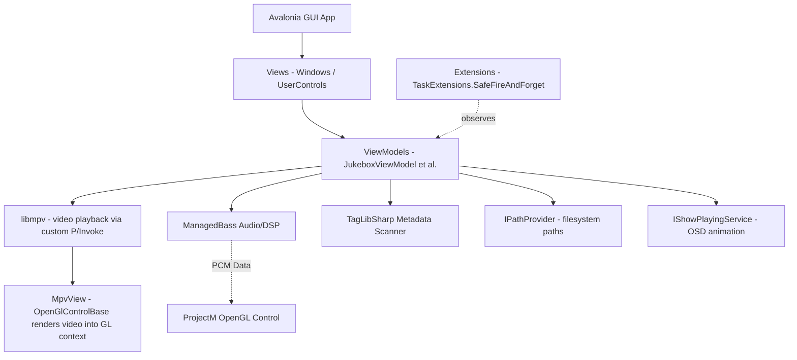

# Jukebox Architecture & Threading Model

This document outlines the architecture, threading constraints, native resource lifecycles, and asynchronous processing models of the Jukebox application. **All AI assistants working on this repository must read this document first** to maintain stability, prevent deadlocks, and avoid native library crashes.

---

## 1. System Architecture

The Jukebox application is a cross-platform desktop media player built with:
*   **Avalonia UI (12.x):** The cross-platform UI framework (using compiled bindings).
*   **.NET 10.0 / C# 13:** Target framework.
*   **libmpv:** For video playback (custom P/Invoke wrapper — `Mpv/MpvNative.cs` + `Mpv/MpvContext.cs`). Renders video into Avalonia's OpenGL context via `OpenGlControlBase`. No native HWND, no airspace issue.
*   **ManagedBass:** For audio playback and DSP/PCM audio data extraction (wraps native BASS).
*   **libvgm:** For VGM/VGZ/VGX audio file emulation and playback (custom P/Invoke wrapper via `Native/VgmNative.cs` and `Services/Playback/VgmPlaybackEngine.cs`). Feeds rendered PCM back into BASS push stream. Supports playing ZIP files containing audio.
*   **JukeboxVisualizations (ProjectM):** An **optional** companion library wrapping native OpenGL `libprojectM` to render milkdrop visualizer presets. Loaded at runtime via reflection — the Jukebox no longer holds a compile-time reference to this assembly. When absent, the visualizer button is hidden and audio plays without any ProjectM dependency.
*   **TagLibSharp:** For background media metadata extraction.
*   **CommunityToolkit.Mvvm:** Source-generator-based MVVM framework (`[ObservableProperty]`, `[RelayCommand]`).

### 1.1. Layered Architecture

The codebase follows a layered MVVM architecture with a dedicated Services layer introduced during the smell-test refactor. ViewModels depend on service interfaces (not static singletons), enabling testability and clear separation of concerns.



### 1.2. Project Layout

```
Jukebox/
├── Constants.cs                 # Merged: media extensions + named constants
├── Models/
│   ├── JukeboxTrack.cs          # Track data model (ObservableObject)
│   └── ThreeButtonDialogConfig.cs # Configuration parameters for ThreeButtonDialog
├── Extensions/
│   └── TaskExtensions.cs        # SafeFireAndForget — observes fire-and-forget Tasks
├── Services/
│   ├── Playback/
│   │   ├── BassPlaybackEngine.cs     # ManagedBass audio playback engine
│   │   ├── IMediaPlayerEngine.cs     # Abstraction for media playback engines
│   │   ├── IVisualizerRuntime.cs     # Optional-visualizer abstraction
│   │   ├── MpvPlaybackEngine.cs      # libmpv video playback engine
│   │   ├── VgmPlaybackEngine.cs      # libvgm VGM playback engine
│   │   └── VisualizerRuntime.cs      # Reflection-based loader for JukeboxVisualizations.dll
│   ├── System/
│   │   ├── IPathProvider.cs          # Canonical filesystem paths interface
│   │   ├── PathProvider.cs           # Default path provider implementation
│   │   ├── IStorageService.cs        # Storage/file picker interface
│   │   ├── StorageService.cs         # Storage/file picker implementation
│   │   └── NativeDependencyChecker.cs # Verification of required native DLLs/SOs
│   └── UI/
│       ├── IShowPlayingService.cs    # Now-playing OSD animation interface
│       ├── ShowPlayingService.cs     # OSD animation service implementation
│       ├── IUserDialogService.cs     # User dialog service interface
│       ├── UserDialogService.cs      # User dialog service implementation
│       └── ThemeService.cs           # Theme service implementation
├── Mpv/                         # Custom libmpv wrapper
│   ├── MpvNative.cs             # P/Invoke declarations for libmpv C API
│   └── MpvContext.cs            # High-level wrapper: playback, properties, events, render
├── ViewModels/
│   ├── ViewModelBase.cs         # Abstract base (ObservableObject)
│   ├── JukeboxViewModel.cs      # Main VM (partial: state, OSD, dispose)
│   ├── JukeboxViewModel.Playback.cs       # Partial: play/pause/seek/timer/engines coordinator
│   ├── JukeboxPlaylistViewModel.cs        # Playlist + virtualized tag loading
│   ├── JukeboxVisualizerViewModel.cs      # ProjectM preset tree + favorites
│   ├── JukeboxEqViewModel.cs              # 10-band EQ + presets + persistence
│   ├── EqSliderViewModel.cs               # Single EQ band VM
│   ├── VisualizerNodeViewModel.cs         # TreeDataGrid node base
│   ├── VisualizerFolderViewModel.cs       # TreeDataGrid folder node
│   └── VisualizerFileViewModel.cs         # TreeDataGrid file node
└── Views/
    ├── JukeboxView.axaml
    ├── JukeboxView.axaml.cs     # Main window lifecycle and media host control
    ├── JukeboxControl.axaml
    ├── JukeboxControl.axaml.cs  # Main user control and inactivity timer
    ├── ContentView.axaml
    ├── ContentView.axaml.cs     # Media host (swaps MpvView / ProjectMControl / empty)
    ├── MpvView.cs               # OpenGL control for libmpv rendering
    ├── PlaylistView.axaml
    ├── PlaylistView.axaml.cs    # Playlist DataGrid and visible range notifications
    ├── TransportBarView.axaml
    ├── TransportBarView.axaml.cs# Media controls and seeking sliders
    ├── VisualizerPickerView.axaml
    ├── VisualizerPickerView.axaml.cs # Visualizer tree picker panel
    ├── RenameDialogView.axaml
    ├── RenameDialogView.axaml.cs # File renaming input dialog
    ├── TextInputDialogView.axaml
    ├── TextInputDialogView.axaml.cs # General text input dialog
    ├── ThreeButtonDialogView.axaml
    └── ThreeButtonDialogView.axaml.cs # Dialog with up to three choice buttons
```

---

## 2. Native Resource Lifecycles & Disposal Rules

Interfacing with native unmanaged DLLs (`libmpv-2.dll`, `bass.dll`, and optionally `libprojectM.dll`) requires strict sequence enforcement during initialization and shutdown. Failure to adhere to these rules results in instant native **Access Violation** crashes or process deadlocks. The `libprojectM.dll` is optional — it is only loaded at runtime when the user has dropped in the visualization files; otherwise it plays no role in the audio path.

**Native library layout:** All native runtimes live under a single flat `<appdir>/lib/` folder. Windows `.dll` and Linux `.so` files coexist by extension; each loader (`MpvNative.cs`, `PlaybackBASS.cs::PreloadBassNative`, `ProjectMNative.cs`) picks the right filename per OS at runtime. The `lib/` folder is NOT shipped in the repo — it's a drop-in location populated separately.

### 2.1. libmpv (Video Playback)

The video backend uses a custom P/Invoke wrapper (`Mpv/MpvNative.cs` + `Mpv/MpvContext.cs`) around the libmpv C client API. No third-party .NET MPV package is used.

*   **Custom Wrapper:** `MpvNative.cs` declares ~20 P/Invoke functions via `DllImport` with a `NativeLibrary.SetDllImportResolver`. The resolver first tries `<appdir>/lib/libmpv-2.dll` (Windows), `libmpv.so.2` (Linux), or `libmpv.2.dylib` (macOS); if not found there, falls back to the OS default search path (lets Linux users `apt install libmpv-dev` if they prefer). `MpvContext.cs` wraps these into a high-level API (`LoadFile`, `Play`, `Pause`, `SeekAbsolute`, `SetVolume`, `ObserveProperty`).
*   **OpenGL Render Context:** MPV renders video into Avalonia's OpenGL context via `mpv_render_context_create` with `MPV_RENDER_API_TYPE_OPENGL`. The `MpvView` (an `OpenGlControlBase` subclass) creates the render context in `OnOpenGlRender`, passing `GlInterface.GetProcAddress` as the GL function resolver. No native HWND — no airspace issue.
*   **Render Update Callback:** MPV calls `mpv_render_context_set_update_callback` when a new frame is ready. The callback (which must NOT call any mpv API) schedules a render on the UI thread via `RequestNextFrameRendering()`. The callback delegate is stored in a field to prevent GC collection — libmpv holds a raw function pointer.
*   **First-Frame Race Condition:** `PlayVideoAsync` calls `WaitForRenderContextReadyAsync()` before `LoadFile` — this blocks until `MpvView` has created the render context. Without this, MPV starts decoding before the render surface exists, producing a black first frame (see [Wholphin issue #576](https://github.com/damontecres/Wholphin/issues/576)).
*   **Event Thread:** A background `Thread` calls `mpv_wait_event` in a loop to receive property-change notifications (`time-pos`, `duration`, `eof-reached`). Events are marshalled to the UI thread via `Dispatcher.UIThread.Post` and `Task.Run`.
*   **Disposal Sequence:** `MpvContext.Dispose()` nulls the update callback BEFORE freeing the render context (prevents AccessViolation from a callback firing on freed memory), sleeps 50ms to let MPV's threads notice, then frees the render context and terminates the mpv handle. `JukeboxView.CloseAsync` calls `ContentView.DetachMediaHost()` to remove `MpvView` from the visual tree BEFORE `DisposePlaybackAsync` — this triggers `OnOpenGlDeinit` and GL context cleanup before the MPV context is freed.

### 2.2. ManagedBass (Audio Playback & DSP)
*   **DSP Threading:** BASS processes audio streams and runs DSP procedures (`OnDsp`) on its own **unmanaged internal audio thread**.
*   **Event Dispatch Safety:** When `OnDsp` captures PCM data, it invokes the C# event `PcmDataAvailable`. Since this event executes on BASS's internal thread, all subscribers (such as the UI or rendering controls) must handle thread safety and marshaling carefully.
*   **Race-Condition Protection (UI-thread affinity):** The BASS stream handle (`_bassStream`) is read by the UI-thread `PlaybackTimer_Tick` (via `Bass.ChannelGetPosition`) and freed by `BassPlaybackEngine.Dispose()` on the close path. Both run on the UI thread — `PlaybackTimer_Tick` fires from a `DispatcherTimer`, and `DisposePlaybackAsync` runs on the UI thread during window close. Because `DispatcherTimer` callbacks are serialized with other UI-thread work via the message pump, there is no actual concurrency between them. The timer is stopped **before** `Dispose()` is called in `DisposePlaybackAsync` to ensure no further ticks fire after disposal begins. (Note: an earlier version of this doc claimed a `_bassStreamLock` object protected this path — that lock never existed in the code. The actual safety comes from `DispatcherTimer`'s UI-thread affinity, which is sufficient.)
*   **DSP Callback Race Protection:** `OnDsp` runs on BASS's internal audio thread and invokes the `PcmDataAvailable` event. During shutdown, `PcmDataAvailable` is nulled on the UI thread. To prevent a `NullReferenceException` if the field is nulled between the null-check and the `Invoke` call, `OnDsp` uses the standard **local-copy pattern**: `var handler = PcmDataAvailable; if (handler != null) handler.Invoke(...)`. This captures the delegate reference atomically at entry, so even if the field is nulled mid-call, the local copy remains valid. The `Dispose()` method also explicitly calls `Bass.ChannelRemoveDSP` and `Bass.ChannelRemoveSync` **before** `Bass.StreamFree` to guarantee in-flight callbacks have been drained before the stream memory is released.
*   **Equalizer (EQ) Integration:** 
    *   BASS EQ uses the cross-platform **BASS_FX `PeakEQ`** effect (replaces the previous Windows-only `DXParamEQ`). A single FX handle (`_eqFxHandle`) is attached to the active `_bassStream`, and the 10 bands are multiplexed via the `lBand` field in the `BASS_BFX_PEAKEQ` parameter struct. Bandwidth is 1.5 octaves (equivalent to the old 18-semitone `DXParamEQ` setting).
    *   **Cross-Platform:** `PeakEQ` is a pure-DSP effect implemented in the `bass_fx` add-on library (`bass_fx.dll` / `libbass_fx.so` / `libbass_fx.dylib`), which must be shipped in `lib/` alongside `bass.dll` / `libbass.so`. It works on Windows, Linux, and macOS — no platform guards needed. The `bass_fx` binary is preloaded into the process in `BassPlaybackEngine.PreloadBassFxNative()` so BASS can find it when `ChannelSetFX` is called with the PeakEQ effect type.
    *   **Setup Ordering (Critical):** `InitializeEqBands` must be called **after** `PlayAsync` creates the BASS stream. The method guards on `_bassStream != 0`, and calling it before `PlayAsync` silently no-ops. `JukeboxViewModel.StartTrackAsync` calls `PlayAsync` first, then `InitializeEqBands` — this ensures saved EQ gains are applied at every track start.
    *   **Track Transitions:** When changing tracks, `Stop()` releases the old stream (`Bass.StreamFree`), which auto-frees the attached FX handle. During `PlayAsync()`, a new stream is created. `InitializeEqBands` then creates a new PeakEQ FX handle on the new stream and sets parameters for all 10 bands (`Constants.EqBandCount`).
    *   **Binding Lifetime:** The `JukeboxViewModel` remains subscribed to the `EqViewModel.EqBandUpdated` event across all track switches, so changes to EQ sliders instantly update the active stream's parameters. The event is only unsubscribed in `DisposePlaybackAsync()` on application exit.
*   **Stream Creation Failure Handling:** If `Bass.CreateStream` returns `0`, `Bass.LastError` is read and surfaced to the user via `ThreeButtonDialogView.ShowErrorAsync`. The previous behavior (silent return) was a critical UX defect — users clicked Play and nothing happened with no feedback.
*   **Teardown Safety:** To prevent the unmanaged BASS thread from raising events while the application is tearing down:
    1.  `PcmDataAvailable = null;` must be called **first** in `DisposeBass` to sever all listener bindings.
    2.  `Bass.ChannelRemoveDSP(_bassStream, _dspHandle);` and `Bass.ChannelRemoveSync(_bassStream, _endSyncHandle);` detach the callbacks.
    3.  `Bass.StreamFree(_bassStream);` is then called to release the stream.
    4.  Finally, `Bass.Free();` is invoked to unload the unmanaged context (only if `_ownsBassContext` is true).

### 2.3. ProjectM (Optional Companion Visualizations)
*   **Optional Drop-in:** The Jukebox no longer holds a compile-time reference to the `JukeboxVisualizations` assembly. The wrapper is discovered at runtime via reflection in `Services/VisualizerRuntime.cs`. If the assembly (or the `ProjectM` drop-in folder) is absent, `IsVisualizerAvailable` is `false`, the visualizer toggle button in the transport bar is hidden, and audio plays through BASS with no ProjectM dependency.
*   **GL Thread Affinity:** The visualizer control (`ProjectMControl` — typed as `Avalonia.Controls.Control` at the call site, since the wrapper type is not visible at compile time) inherits from `OpenGlControlBase`. The creation, preset loading (`projectm_load_preset_data`), and rendering (`projectm_opengl_render_frame`) of the ProjectM instance **must only occur on the OpenGL render thread** inside the `OnOpenGlRender` loop.
*   **Reflection Adapter:** `IVisualizerRuntime` exposes `CreateControl`, `SetPresetPathBinding`, `StartEngine`, `LoadPreset`, `FeedPcm`, and `TryDispose`. The implementation caches the loaded `Assembly`, the `ProjectMControl` `Type`, the `PresetPathProperty` `AvaloniaProperty`, and the relevant `MethodInfo`s after the first successful probe so repeated calls (per PCM buffer, per preset change) do not pay a reflection cost.
*   **PCM Queueing:** Since PCM data is fed from BASS's audio thread and rendering occurs on the GL thread, data is passed safely via a `ConcurrentQueue<short[]>` inside `ProjectMControl` to avoid lock contention.
*   **Control Lifecycle:** `ProjectMControl` is an Avalonia `UserControl` and does **not** implement `IDisposable`. Teardown is achieved by removing it from the visual tree (`MediaHost.Content = null`), which triggers Avalonia's `Unloaded` handler — that is the correct lifecycle path for native Avalonia controls. The `IVisualizerRuntime.TryDispose` method defensively checks `is IDisposable` before attempting disposal, future-proofing against a potential API change.

*   **FBO Hooking / Default Framebuffer Redirection:** Upstream `libprojectM` natively targets FBO `0` (the default window system backbuffer) for its final compositing pass. Since Avalonia renders custom controls offscreen into private non-zero Framebuffer Objects (supplied as the `fb` parameter in `OnOpenGlRender`), projectM's drawing commands would otherwise be sent to FBO `0` and never composite. We resolve this by hooking the global `__glewBindFramebuffer` function pointer inside `glew32.dll` immediately after `glewInit()`. During `projectm_opengl_render_frame`, our hook intercepts any binding requests targeting `0` and redirects them to Avalonia's offscreen FBO `fb`. Standard binding behavior is restored immediately after the render call finishes.


### 2.4. No Airspace Issue (MPV Migration)

The previous LibVLCSharp `VideoView` was a `NativeControlHost` that created a native HWND — XAML siblings were painted over by the native video surface (the "airspace problem"). This required complex overlay-window workarounds (two-chrome architecture, LibVLCSharp's detached overlay window, visibility converters) that were fragile and hard to maintain.

**MPV eliminates the airspace problem entirely.** `MpvView` is an `OpenGlControlBase` subclass that renders video into Avalonia's OpenGL context — no native HWND, no separate window. Side panels (Playlist, Visualizer Picker), transport bar, and EQ overlay are normal XAML siblings of `ContentView` that render on top via standard Z-order. No overlay windows, no chrome instances, no visibility converters.

**Single `OpenGlControlBase` at a time:** `ContentView` uses a `ContentControl` (`MediaHost`) that swaps between three states — `MpvView` (video mode), `ProjectMControl` (audio mode + visualizer available), and empty (audio mode + visualizer unavailable). Only one `OpenGlControlBase` is in the visual tree at a time — each creates its own private GL context, and having two simultaneously can break ProjectM's initialization. When switching modes, the old control is removed (`MediaHost.Content = null`), triggering `OnOpenGlDeinit` and GL context cleanup, before the new control is attached. The empty state is used when audio (including VGM files or ZIP audio contents) is playing but the optional `ProjectM` drop-in is not present — the MediaHost simply has no content (no `OpenGlControlBase`), and BASS plays audio normally with no GL cost.

### 2.5. libvgm (VGM Emulation Playback)

The VGM playback engine plays `.vgm`, `.vgz`, and `.vgx` video game music files.

*   **C API Shim:** Valley Bell's native `libvgm` is built in C++. Because C++ classes cannot be directly P/Invoked, we ship a custom flat C API wrapper (`vgm-player` / `libvgm-player.so` / `libvgm-player.dylib` in the `lib/` directory) wrapping `PlayerA` and sound cores.
*   **P/Invoke Loading & Export Resolution:** Because `MpvNative` already registers a DLL import resolver for the assembly, the `VgmNative` static class performs manual library loading via `NativeLibrary.Load` and resolves function exports directly into delegates.
*   **Audio Rendering Loop:** When a track begins, `VgmPlaybackEngine` starts a dedicated rendering loop on a background thread. This thread continuously pulls 16-bit signed stereo 44100Hz PCM samples from `libvgm`.
*   **BASS Integration:** The rendered PCM bytes are written into a BASS push stream (`Bass.StreamPutData`). This allows VGM audio emulation to run through the standard ManagedBass pipeline, automatically supporting equalizer sliders, DSP PCM callbacks, and visualizations.

### 2.6. Media Host Teardown in `ContentView`
`ContentView` uses a `ContentControl` (`MediaHost`) that swaps between `MpvView`, `ProjectMControl`, and empty. Teardown on window close:
*   `JukeboxView.CloseAsync` calls `ContentView.DetachMediaHost()` — sets `MediaHost.Content = null`, removing the active `OpenGlControlBase` from the visual tree BEFORE `DisposePlaybackAsync` runs. This triggers `OnOpenGlDeinit` and GL context cleanup, preventing AccessViolation from the render callback firing on a freed render context.
*   `OnUnloaded` detaches all VM event handlers (`PropertyChanged`, `VisualizerViewModel.PropertyChanged`, `PcmDataAvailable`), clears `MediaHost.Content`, and asks the `IVisualizerRuntime` to dispose the `ProjectMControl` if it implements `IDisposable`.
*   `MpvView` does not need explicit disposal — its render context is owned by `MpvContext` (the VM), which disposes it via `DisposeMpvAsync`.
*   Dispose-path exceptions are logged via `Trace.WriteLine` (survives Release builds).

---

## 3. Asynchronous Threading & Responsiveness

To keep the UI running smoothly at 60 FPS, all CPU-bound or I/O-bound processes are offloaded to background threads.

### 3.1. Virtualized Metadata Tagging
When directories containing thousands of tracks are loaded into the playlist, parsing metadata (`TagLibSharp`) for all files instantly would freeze the application. 
*   **On-Demand Loading:** Tracks are initially loaded with dummy metadata. 
*   **Scroll-Driven Batching:** The `DataGrid` view notifies the view model of the visible index range (`NotifyVisibleRange`).
*   **Background Processing:** The view model triggers `TagVisibleRangeAsync`, which reads tags in small batches (`Constants.TagBatchSize = 5`) on background ThreadPool threads (`Task.Run`).
*   **Version Tracking:** To prevent late-completing background reads from writing metadata to the wrong tracks (e.g., if the user clears the playlist and loads a new one while tagging is active), the VM increments `_playlistVersion` and `_scrollVersion`. Completed background tasks reject their results if their captured version doesn't match the current active version.
*   **Resilient File Enumeration:** `DiscoverFiles` uses `EnumerationOptions { IgnoreInaccessible = true, RecurseSubdirectories = ... }` so permission-denied directories on Linux don't abort the entire scan.

### 3.2. ProjectM Preset Scan (only when the optional drop-in is present)
The visualizations folder contains a massive database of milkdrop presets (9,000+ `.milk` files). The scan is skipped entirely when the `ProjectM` drop-in folder is absent — `LoadVisualizersAsync` no-ops cleanly in that case.
*   **Asynchronous Scan:** `LoadVisualizersAsync` in `JukeboxVisualizerViewModel` processes filesystem scanning recursively inside `Task.Run(...)`. Paths are resolved via `IPathProvider.ProjectMPresetsDirectory` (single source of truth — no more duplicated `Path.Combine(AppDomain.CurrentDomain.BaseDirectory, ...)` calls).
*   **UI Dispatch:** Once the folders are cataloged, the hierarchical tree node structures are built and dispatched to the UI thread via `Dispatcher.UIThread.Post(...)` to populate the `TreeDataGrid` bindings safely.
*   **No-op when unavailable:** When the `ProjectM` folder is not present, the method logs a single `[Visualizer]` message and returns immediately. The picker tree stays empty, but the audio playback path is completely unaffected.

### 3.3. Fire-and-Forget Observation (`SafeFireAndForget`)
Several call sites need to start async work without awaiting it (e.g., OSD animation triggered from a PropertyChanged handler, dispose on window close, background settings persistence). The codebase previously used `_ = SomeAsyncMethod()`, which silently swallowed any exception via `TaskScheduler.UnobservedTaskException`.

The `TaskExtensions.SafeFireAndForget(this Task, string operationName)` extension method captures and logs exceptions via `Debug.WriteLine`:

```csharp
// Before (smell — silent failure):
_ = DisposePlaybackAsync();

// After (observed, logged on failure):
DisposePlaybackAsync().SafeFireAndForget(nameof(DisposePlaybackAsync));
```

**All 11 former fire-and-forget sites** in the codebase now use this pattern. The method returns `void` (not `Task`), so it must be called as a statement — never assigned to `_ =`.

### 3.4. Async Initialization Pattern
File IO must never run inside a ViewModel constructor (it blocks the UI thread and makes the VM untestable). Two VMs previously violated this rule; both now expose an async `InitializeAsync()` / `LoadAsync()` method to be called from the View's `Loaded` handler:

```csharp
// In JukeboxView.OnLoaded:
vm.InitializeBackendAsync().SafeFireAndForget(nameof(vm.InitializeBackendAsync));
vm.VisualizerViewModel.LoadVisualizersAsync().SafeFireAndForget(nameof(vm.VisualizerViewModel.LoadVisualizersAsync));
vm.VisualizerViewModel.InitializeAsync().SafeFireAndForget(nameof(vm.VisualizerViewModel.InitializeAsync));   // loads last_preset.txt
vm.EqViewModel.LoadAsync().SafeFireAndForget(nameof(vm.EqViewModel.LoadAsync));                                // loads EqSettings.json
```

If the VM is constructed outside a View (e.g., in a design-time preview or another Window), the caller is responsible for invoking these methods after setting the `DataContext`.

### 3.5. EQ Settings Persistence (Debounced)
The `JukeboxEqViewModel` previously wrote `EqSettings.json` to disk on every slider drag tick — a synchronous write that could stall the UI. The refactor introduces a 300ms `DispatcherTimer` debounce: each `Gain` change restarts the timer, and only the final change in the 300ms window triggers an async `SaveEqSettingsAsync()` via `Task.Run`. Reads happen once at startup via `LoadAsync()`.

---

## 4. Normal Window Closing Lifecycle

When a user closes the player, the exit sequence is orchestrated to (a) never block the UI thread on native teardown, (b) capture and log any disposal failures instead of crashing, and (c) bound the wait so a misbehaving backend cannot hang the close indefinitely.

> **Critical:** The previous implementation used `protected override async void OnClosing(...)`. `async void` methods cannot be awaited by the caller, and any exception thrown after the first `await` crashes the process (not catchable). The refactor replaces this with a synchronous `OnClosing` override that defers actual cleanup to a `CloseAsync()` Task.

```
[User Clicks Close]
       │
       ▼
[JukeboxView.OnClosing] (sync override — sets e.Cancel = true, flags _isClosing, fires _ = CloseAsync())
       │
       ▼
[CloseAsync()] (private async Task, runs on UI thread)
       │
       ├─► Find ContentView via visual tree, call DetachMediaHost()
       │       └─► MediaHost.Content = null → removes MpvView/ProjectMControl from visual tree
       │           └─► Triggers OnOpenGlDeinit → GL context cleanup (BEFORE MPV disposal)
       │
       ├─► try {
       │       if (DataContext is JukeboxViewModel vm)
       │           await vm.DisposePlaybackAsync()
       │               .WaitAsync(TimeSpan.FromMilliseconds(Constants.DisposeTimeoutMs));   // 3000ms cap
       │   }
       ├─► catch (TimeoutException) { Debug.WriteLine("timed out; closing anyway"); }
       ├─► catch (Exception ex)    { Debug.WriteLine($"failed: {ex.Message}"); }
       │
       ▼
[DisposePlaybackAsync()] chains:
       ├─► Unsubscribe _subscribedTrack.PropertyChanged (with ReferenceEquals guard)
       ├─► EqViewModel.EqBandUpdated -= OnEqBandUpdated
       ├─► _playbackTimer.Stop()  ← before engine dispose (DispatcherTimer = UI-thread serialized)
       ├─► _bassEngine.Dispose()  (synchronous — no Task.Run)
       │       ├─► PcmDataAvailable = null
       │       ├─► Bass.ChannelRemoveDSP / ChannelRemoveSync (explicit, before StreamFree)
       │       ├─► Bass.StreamFree(_bassStream)
       │       └─► Bass.Free()  (only if _ownsBassContext)
       └─► _mpvEngine.Dispose()  (synchronous — no Task.Run, was fire-and-forget)
               ├─► Null the render update callback (BEFORE freeing render context)
               ├─► Sleep 50ms (let MPV threads notice null callback)
               ├─► mpv_render_context_free
               └─► mpv_terminate_destroy
       │
       ▼
[Window.Close()] (actually terminate the window — called from CloseAsync after await completes)
       │
       ▼
[App.desktop.Exit] -> [JukeboxViewModel.Dispose()]
       ├─► Unsubscribe Playlist.CollectionChanged (named method, not lambda)
       ├─► Unsubscribe PlaylistViewModel.PlaylistCleared
       ├─► Unsubscribe _showPlayingService.Changed
       ├─► Cancel + dispose _showPlayingCts
       ├─► _showPlayingService.Hide()
       ├─► VisualizerViewModel?.Dispose()
       └─► DisposePlaybackAsync().SafeFireAndForget(...)   // observed fire-and-forget
```

**Key invariants:**
*   `OnClosing` is **synchronous** — it cannot throw exceptions that escape to `async void` and crash the process.
*   `DisposePlaybackAsync` is awaited with a **3-second timeout** (`Constants.DisposeTimeoutMs`). If MPV/BASS disposal hangs (race with native callbacks), the window still closes — the alternative was an indefinite hang.
*   The playback timer is stopped **before** engine dispose in `DisposePlaybackAsync`. Since both `PlaybackTimer_Tick` (via `DispatcherTimer`) and `DisposePlaybackAsync` run on the UI thread, they are serialized by the message pump — no lock is needed. (An earlier version of this doc claimed a `_bassStreamLock` protected this path; that was doc drift — the lock never existed in the code.)
*   The `_subscribedTrack` field tracks the currently-subscribed `JukeboxTrack` (replaces the old `_lastTrack`). A `ReferenceEquals` guard prevents double-subscription when the same track is set twice.

---

## 5. Service Layer

The smell-test refactor extracted several responsibilities from the god-class `JukeboxViewModel` into dedicated services. All services are interface-backed and have default implementations; tests can inject mocks via the new parameterized constructors.

### 5.1. `IPathProvider` / `PathProvider`
Single source of truth for all canonical filesystem paths. Replaces the 5 duplicated `Path.Combine(AppDomain.CurrentDomain.BaseDirectory, ...)` call sites across the codebase.

```csharp
public interface IPathProvider
{
    string NativeLibDirectory { get; }             // <appdir>/lib (flat — all native runtimes + JukeboxVisualizations.dll)
    string JukeboxVisualizationsDllPath { get; }   // <appdir>/lib/JukeboxVisualizations.dll
    string ProjectMRoot { get; }                   // <appdir>/ProjectM (preset data only)
    string ProjectMPresetsDirectory { get; }       // <appdir>/ProjectM/presets
    string ProjectMFavoritesDirectory { get; }     // <appdir>/ProjectM/presets/favorites
    string LastPresetFile { get; }                 // <appdir>/ProjectM/last_preset.txt
    string SettingsDirectory { get; }              // <AppData>/Jukebox (cross-platform)
    string EqSettingsFile { get; }                 // <AppData>/Jukebox/EqSettings.json
}
```

*   **`NativeLibDirectory`** is the flat folder containing all drop-in files: native runtime libraries (`bass.dll`, `libmpv-2.dll`, `libprojectM.dll`, `glew32.dll` on Windows; `libbass.so`, `libmpv.so.2`, `libprojectM.so.4` on Linux) AND the optional `JukeboxVisualizations.dll` managed wrapper. Loaders pick the right filename per OS at runtime; Windows `.dll` and Linux `.so` coexist by extension.
*   **`JukeboxVisualizationsDllPath`** is `<appdir>/lib/JukeboxVisualizations.dll` — the wrapper lives in `lib/` alongside the native libprojectM binary, keeping all optional drop-in files in one place.
*   **`ProjectMRoot`** contains ONLY preset data. The native `libprojectM` binary and the `JukeboxVisualizations.dll` wrapper both live in `NativeLibDirectory`.
*   **Cross-platform behavior:** `SettingsDirectory` uses `Environment.GetFolderPath(Environment.SpecialFolder.ApplicationData)`, which resolves to `~/.config` on Linux/macOS and `%AppData%\Roaming` on Windows.
*   **Singleton access:** `PathProvider.Current` returns the active instance. Tests can override via `PathProvider.Override(stub)` and reset via `PathProvider.Reset()`.

### 5.2. `IShowPlayingService` / `ShowPlayingService`
Encapsulates the "show playing" OSD animation: 3-second hold at full opacity, then 60-step fade over 3 seconds. Extracted from `JukeboxViewModel.TriggerShowPlayingOSDAsync` (which was an MVVM-leakage smell — the VM "knew" about UI animation timing).

```csharp
public interface IShowPlayingService
{
    bool IsVisible { get; }
    double Opacity { get; }
    string Text { get; }
    event EventHandler<ShowPlayingEventArgs>? Changed;
    Task ShowAsync(string text, CancellationToken cancellationToken = default);
    void Hide();
}
```

*   The VM subscribes to `Changed` and forwards the `Text` / `Opacity` / `IsVisible` values to its own observable properties for XAML binding.
*   `ShowAsync` cancels any previously-running animation via an internal `CancellationTokenSource` (pattern matches the original behavior, but now lives behind an interface).
*   The `Changed` event is dispatched to the UI thread via `Dispatcher.UIThread.Post` so callers can invoke `ShowAsync` from any thread (e.g., from a BASS end-sync callback).

### 5.3. `TaskExtensions.SafeFireAndForget`
See §3.3. Extension method on `Task` that captures and logs exceptions from fire-and-forget async work.

---

## 6. Constants

All magic numbers and shared constants live in the `Constants` static class (namespace `Jukebox`). This is a single merged file containing both the original media/path constants and the named constants extracted during the refactor.

| Constant | Value | Purpose |
|----------|-------|---------|
| `AudioExtensions` | `string[]` | `.mp3 .flac .wav .ogg .m4a .wma` |
| `VideoExtensions` | `string[]` | `.mp4 .mkv .avi .webm` |
| `SupportedMediaExtensions` | `HashSet<string>` | Union of audio + video (case-insensitive) |
| `SettingsDirectoryName` | `"Jukebox"` | Subfolder under `ApplicationData` |
| `EqSettingsFileName` | `"EqSettings.json"` | EQ preset file name |
| `PlaybackTimerIntervalMs` | `250` | UI timer tick for playback position updates |
| `OsdHoldMs` | `3000` | OSD full-opacity hold duration |
| `OsdFadeSteps` | `60` | Number of fade-out steps |
| `OsdStartOpacity` | `0.5` | Starting OSD opacity (0.0–1.0) |
| `EqBandCount` | `10` | Number of EQ bands (must match `_eqFxHandles` array size) |
| `TagBatchSize` | `5` | Tracks tagged per batch in `TagVisibleRangeAsync` |
| `TagAllThreshold` | `100` | Below this count, tag all tracks immediately |
| `DefaultControlBarHeight` | `65` | Visible transport bar height (px) |
| `HiddenControlBarHeight` | `0` | Auto-hidden transport bar height (px) |
| `ControlBarInactivitySeconds` | `5` | Inactivity before auto-hide |
| `ScrollIdleMs` | `500` | Idle period before visible-range tag refresh |
| `ScrollDebouncePollMs` | `50` | Scroll debounce timer poll interval |
| `DisposeTimeoutMs` | `3000` | Max wait for playback disposal on window close |

**Adding a new constant:** add it to `Constants.cs` in `namespace Jukebox`. All ViewModels and Views can reference it as `Constants.X` without a `using` statement because `Jukebox.ViewModels` and `Jukebox.Views` are child namespaces of `Jukebox`.

---

## 7. Testability

The refactor introduced optional constructor overloads on three ViewModels so tests can inject mock services without triggering native backend initialization:

```csharp
// Production (default constructors — instantiate real services)
public JukeboxViewModel()  →  calls  new ShowPlayingService()
public JukeboxVisualizerViewModel()  →  calls  PathProvider.Current
public JukeboxEqViewModel()  →  calls  PathProvider.Current

// Test (inject mocks)
public JukeboxViewModel(IShowPlayingService showPlayingService)
public JukeboxVisualizerViewModel(IPathProvider pathProvider)
public JukeboxEqViewModel(IPathProvider pathProvider)
```

**What still needs DI for full testability (deferred to §7.3 of the smell-test report):**
*   `IStorageService` (file dialogs) — currently a public settable property, not constructor-injected
*   `MpvContext` — currently created directly in `InitializeMpv()`, not injected
*   `ILogger<T>` — currently `Debug.WriteLine` / `Trace.WriteLine` everywhere; needs `Microsoft.Extensions.Logging` + DI container
*   `IPlaybackBackend` — BASS and MPV are still hardcoded behind `if (IsVisualizerVisible)` switches; needs an interface abstraction to make backends swappable

> **Note:** `IVisualizerRuntime` IS now injectable on `JukeboxViewModel` (public settable property defaulting to `VisualizerRuntime.Current`). Tests can replace it with a stub that always returns `IsAvailable = false` to exercise the no-visualizer code paths without needing the native `libprojectM` runtime.

---

## 8. Smell-Test Report Cross-Reference

This document reflects the codebase after the smell-test refactor. The full audit findings and remediation roadmap are in `Avalonia_CodeBehind_Smell_Test_Report.pdf`. Key changes applied:

| Report § | Smell | Status |
|----------|-------|--------|
| §4.1 | God class | **Deferred** (multi-sprint refactor — §7.3 #15) |
| §4.1 | Fire-and-forget DisposePlaybackAsync | **Fixed** — `SafeFireAndForget` |
| §4.1 | Lambda event subscription | **Fixed** — named method, unsubscribed in Dispose |
| §4.1 | OSD dispatcher coupling | **Fixed** — extracted to `ShowPlayingService` |
| §4.2 | Race: Tick vs Dispose | **Fixed** — `DispatcherTimer` UI-thread affinity + timer-stop-before-dispose (doc previously claimed `_bassStreamLock` — corrected) |
| §4.2 | OnCurrentTrackChanged event leak | **Fixed** — `ReferenceEquals` guard + `_subscribedTrack` |
| §4.3 | Silent Bass.CreateStream failure | **Fixed** — error dialog with `Bass.LastError` |
| §4.3 | Cross-platform EQ | **Fixed** — ported to BASS_FX `PeakEQ` (cross-platform, requires `bass_fx.dll`/`libbass_fx.so` in `lib/`) |
| §4.4 | OnMediaPlayerEndReached double-marshall | **N/A** — VLC removed; MPV uses property observation |
| §4.4 | Silent VLC catches | **N/A** — VLC removed; MPV errors logged via `Trace.WriteLine` |
| §4.4 | Volume cast precision | **Fixed** — `(int)Math.Round(Volume)` |
| §4.5 | Sync file IO in constructor | **Fixed** — `InitializeAsync()` |
| §4.5 | File.WriteAllText in PropertyChanged | **Fixed** — `SafeFireAndForget` + logging |
| §4.5 | Regex recompilation | **Fixed** — `static readonly Regex` with `Compiled` flag |
| §4.5 | File.Copy / File.Delete without confirm | **Fixed** — `ThreeButtonDialogView.ShowConfirmAsync` |
| §4.7 | Sync JSON IO in EQ VM | **Fixed** — `LoadAsync()` + debounced save |
| §5.1 | Native control attachment without teardown | **Fixed** — `OnUnloaded` handler |
| §5.3 | `async void OnClosing` | **Fixed** — sync `OnClosing` + `CloseAsync()` with timeout |
| §6.1 | Fire-and-forget async (11 sites) | **Fixed** — all wrapped with `SafeFireAndForget` |
| §6.3 | Path handling (5 sites) | **Fixed** — `IPathProvider` |
| §6.4 | Magic numbers (7 sites) | **Fixed** — merged into `Constants` class |
| §6.5 | Inconsistent error logging | **Partial** — `Console.WriteLine` → `Debug/Trace.WriteLine`; `ILogger<T>` deferred |

---

## 9. MPV Migration (LibVLCSharp → libmpv)

LibVLCSharp was replaced with a custom libmpv P/Invoke wrapper. Key changes:

### 9.1. Architecture Change

| Aspect | Before (LibVLCSharp) | After (libmpv) |
|--------|----------------------|-----------------|
| Video rendering | `NativeControlHost` (native HWND) | `OpenGlControlBase` (Avalonia GL context) |
| Airspace | XAML siblings hidden by native video | No airspace — normal Z-order |
| Overlay architecture | Two-chrome + LibVLCSharp overlay window (complex, fragile) | Not needed — eliminated entirely |
| NuGet packages | `LibVLCSharp.Avalonia` + `VideoLAN.LibVLC.Windows` | None — custom P/Invoke wrapper |
| Native DLL | `libvlc.dll` (~40MB + plugins) | `libmpv-2.dll` (~15MB, single file) |
| Video API | `MediaPlayer.Play()` / `Media` objects / events | `MpvContext.LoadFile()` / property commands / property observation |

### 9.2. New Files

| File | Purpose |
|------|---------|
| `Mpv/MpvNative.cs` | P/Invoke declarations for ~20 libmpv C functions + `NativeLibrary.SetDllImportResolver` for cross-platform loading |
| `Mpv/MpvContext.cs` | High-level wrapper: `Initialize()`, `LoadFile()`, `Play()` / `Pause()` / `Stop()`, `SeekAbsolute()`, `SetVolume()`, `ObserveProperty()`, `WaitForRenderContextReadyAsync()`. Owns mpv handle, event thread, render context. Implements `IDisposable`. |
| `Views/MpvView.cs` | `OpenGlControlBase` subclass — creates render context in `OnOpenGlRender`, sets update callback (stored in field to prevent GC), renders frames into Avalonia's FBO. `MpvContext` styled property binds to the VM. |
| `ViewModels/JukeboxViewModel.PlaybackMPV.cs` | Video playback via MPV (replaces `PlaybackVLC.cs`). Uses `MpvContext` for all video operations. |

### 9.3. Critical Design Decisions

1. **Single `OpenGlControlBase` at a time.** `ContentView` uses a `ContentControl` (`MediaHost`) that swaps between `MpvView` (video), `ProjectMControl` (audio + visualizer available), and empty (audio + visualizer unavailable). Having two `OpenGlControlBase` instances in the visual tree simultaneously breaks ProjectM's GL initialization — each creates its own private context. The empty state is the only one with no GL cost.

2. **First-frame race condition fix.** `PlayVideoAsync` awaits `WaitForRenderContextReadyAsync()` before `LoadFile` — blocks until `MpvView` has created the render context. Without this, MPV starts decoding with no output surface → black first frame. See [Wholphin issue #576](https://github.com/damontecres/Wholphin/issues/576).

3. **Safe close sequence.** `JukeboxView.CloseAsync` calls `ContentView.DetachMediaHost()` to remove `MpvView` from the visual tree BEFORE `DisposePlaybackAsync`. This triggers `OnOpenGlDeinit` → GL context cleanup. Then `MpvContext.Dispose()` nulls the update callback, sleeps 50ms, frees the render context, and terminates the mpv handle.

4. **Render callback delegate lifetime.** The `MpvUpdateCallback` delegate is stored in a field (`_updateCallback`) — libmpv holds a raw function pointer, and if the delegate is GC'd, the next callback crashes with AccessViolationException.

5. **`Wgl` rendering mode.** Program.cs uses `Win32RenderingMode.Wgl` (native OpenGL). ANGLE EGL was tried but broke ProjectM — `libprojectM` was compiled against WGL. MPV's render API works with any GL backend via the `get_proc_address` callback.
